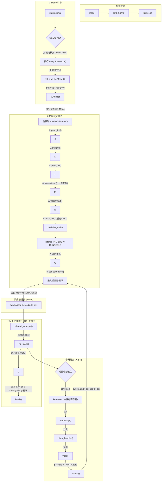

好的，你已经成功地将“进程”这一灵魂注入了`my_os`，`README.md`也必须跟上这个巨大的飞跃。

基于你现有的`README.md`，我已经为你准备好了更新版本。这个版本在原有基础上：

1.  在“功能特性”中添加了**进程管理**和**抢占式调度**。
2.  更新了“项目结构”，加入了所有新文件（`proc.c`, `spinlock.c`, `swtch.S`等）。
3.  **完全重写**了“工作原理解析”，将其升级为包含**进程调度**和**生命周期管理**的全新描述。
4.  更新了“系统流程示意图”，加入了`scheduler`和`kfork`（以`user_init`为例）的流程。

请用下面的完整内容替换你现有的 `README.md`：

-----

# riscv-os: 一个极简的RISC-V操作系统内核

**riscv-os** 是一个为教学目的而创建的、极简的操作系统内核。它基于 **RISC-V 64位架构**，能在 **QEMU virt** 模拟环境中启动。本内核清晰地展示了从硬件引导、内存管理、中断处理到**抢占式多任务调度**的完整流程。

这个项目的核心目标是让学习者深入理解操作系统的引导过程、分层设计思想、虚拟内存机制以及进程管理的实现原理。

-----

## ✨ 功能特性

  - **平台**: RISC-V (RV64GC)
  - **目标机器**: QEMU virt machine
  - **语言**: C 和 RISC-V 汇编

### 核心功能

  - **完整启动链**: 实现了从汇编入口(`entry.S`)到C语言主函数(`kmain`)的完整引导流程。
  - **C语言环境**: 建立了基本的C语言运行时环境，包括设置栈指针和清零BSS段。
  - **分层输出系统**: 构建了 `printf` -\> `console` -\> `uart` 的三层解耦输出架构。
  - **格式化输出**: 实现了功能丰富的`printf`，支持 `%d`, `%x`, `%p`, `%s`, `%c` 及 `%%` 等常用格式。
  - **虚拟内存**: 实现了基于Sv39规范的三级页表，支持内核空间的恒等映射（Identity Mapping）。
  - **物理内存管理**: 实现了基于侵入式链表的物理页分配器（PMM）。
  - **错误处理**: 设计了一个基本的`panic`致命错误处理机制。

### 特权级与进程管理

  - **M/S特权级分离**: 内核引导程序运行在M-Mode（`start.c`），负责硬件初始化与中断委托；内核主体运行在S-Mode（`kmain.c`, `proc.c`），负责核心逻辑。
  - **陷阱(Trap)处理框架**: 建立了统一的中断/异常处理入口(`kernelvec.S`)，能够进行上下文的精确保存与恢复。
  - **时钟中断**: 成功实现了由硬件时钟驱动的周期性中断。
  - **抢占式调度**: `scheduler` 实现了一个轮转调度器，并由时钟中断 触发 `yield`，实现了抢占式多任务。
  - **进程生命周期**: 实现了完整的进程（内核线程）生命周期管理，包括 `kfork`, `kexit`, `kwait`，以及通过 `initproc` 实现的孤儿进程回收。
  - **同步原语**: 实现了底层的自旋锁（`spinlock.c`） 和高层的 `sleep`/`wakeup` 同步机制。

-----

## 🛠️ 环境依赖

在开始之前，请确保你已经安装了以下工具：

  - **RISC-V 交叉编译工具链**: `riscv64-unknown-elf-gcc`
  - **QEMU 模拟器**: `qemu-system-riscv64`
  - **GNU Make**

在 Ubuntu/Debian 系统中，你可以通过以下命令安装：

```bash
sudo apt-get update
sudo apt-get install build-essential git gcc-riscv64-unknown-elf qemu-system-misc
```

-----

## 🚀 如何编译和运行

1.  **克隆或下载项目**

<!-- end list -->

```bash
git clone https://github.com/ABChaha11/my_os.git
cd my_os
```

2.  **编译内核** 在项目根目录下执行 `make` 命令。

<!-- end list -->

```bash
make
```

该命令会编译所有源文件并链接生成 `kernel/kernel.elf` 内核镜像。

3.  **在 QEMU 中运行**
    执行 `make qemu` 命令。

<!-- end list -->

```bash
make qemu
```

你将会观察到一个动态的输出过程，展示了从M-Mode到S-Mode的切换、`init`进程的启动，以及所有内核测试的通过：

**预期的终端输出**：

```
--- riscv-os Kernel Booting ---
pmm: initializing...
pmm: managing memory from 0x80007000 to 0x88000000
pmm: initialization complete.
kvminit: creating kernel page table...
kvminit: mapped uart (0x10000000)
kvminit: mapped kernel text [0x80000000, 0x800026d2)
kvminit: mapped kernel data and ram [0x80003000, 0x88000000)
kvminit: kernel page table created successfully.
proc_init: process table initialized.
proc_init: kernel stacks mapped.
kvminithart: virtual memory enabled.
trapinithart: stvec set to 0x800018b0
user_init: init process created.
kmain: S-Mode interrupts enabled.
kmain: starting scheduler...
init_main: starting... (ticks = 0)
--- Testing Basic Cases ---
Testing integer: 42
...
--- Testing PMM ---
...
  PMM test passed.
--- Testing VM ---
  Kernel text mapping OK.
  Kernel data mapping OK.
  UART mapping OK.
  VM test passed.

--- Testing Timer Interrupt ---
  (ticks 会在后台由中断自动增加)
  Timer test passed (ticks = 6).

--- All tests passed! ---
Kernel is now multitasking.
```

4.  **清理生成文件**

<!-- end list -->

```bash
make clean
```

-----

## 📁 项目结构

```
riscv-os/
├── kernel/
│   ├── entry.S        # M-Mode汇编入口：设置初始栈、清零BSS、跳转到M-Mode C
│   ├── start.c        # M-Mode C代码：负责中断委托、PMP配置，并通过mret切换到S-Mode
│   ├── kernelvec.S    # S-Mode汇编入口：中断/异常的统一入口，负责上下文保存与恢复
│   ├── trap.c         # S-Mode C代码：中断/异常的总分发与处理逻辑
│   ├── kernel.ld      # 链接器脚本：定义内核内存布局
│   ├── main.c         # S-Mode C主函数(kmain)：内核初始化引导
│   ├── uart.c         # 硬件抽象层：串口驱动
│   ├── console.c      # 控制台层：封装串口，处理特殊序列
│   ├── printf.c       # 格式化层：实现printf
│   ├── pmm.c          # 物理内存管理器
│   ├── vm.c           # 虚拟内存(页表)管理器
│   ├── proc.c         # (新增) 进程管理、调度器、生命周期、sleep/wakeup
│   ├── spinlock.c     # (新增) 自旋锁实现
│   └── swtch.S        # (新增) 上下文切换汇编代码
├── include/
│   ├── uart.h
│   ├── console.h
│   ├── printf.h
│   ├── pmm.h
│   ├── vm.h
|   ├── tests.h        # 包含测试函数的头文件
│   ├── trap.h         # 中断陷阱相关声明
│   ├── riscv.h        # RISC-V CSR/分页宏定义
│   ├── memlayout.h    # 内存布局常量
│   ├── types.h        # 基本类型定义
│   ├── param.h        # 内核参数定义 (NCPU, NPROC)
│   ├── defs.h         # 内核函数声明
│   ├── spinlock.h     # (新增) 自旋锁声明
│   └── proc.h         # (新增) 进程/CPU/上下文结构体声明
├── Makefile           # 自动化构建脚本
└── README.md          # 本文档
```

-----

## 🔬 工作原理解析

本内核的启动与运行是一条精心设计的、跨越M/S特权级的多任务执行链：

1.  **链接 (kernel.ld)**
    `Makefile` 调用链接器 `ld`，根据 `kernel.ld` 的指示，将所有编译好的代码和数据（`.o`, `.S`）打包成 `kernel.elf`。`kernel.ld` 定义了内核的基地址（`0x80000000`）和段的内存布局（如 `.text`, `.rodata`, `.data`）。

2.  **M-Mode引导 (entry.S -\> start.c)**
    QEMU 将内核加载到 `0x80000000` 并开始执行。此阶段完全运行在\*\*机器模式（M-Mode）\*\*下，其唯一目标是为S-Mode内核准备环境。

      - **`entry.S`**: 硬件启动的第一个入口点，负责设置M-Mode栈指针（`sp`）和清零BSS段。
      - **`start.c`**: M-Mode的配置中心。它负责将所有中断和异常**委托**给S-Mode（`medeleg`, `mideleg`），配置PMP，预约第一次时钟中断，并将`tp`寄存器设为hartid（CPU ID）。最后，它设置`mepc`指向`kmain`，执行`mret`指令，原子地将控制权和特权级移交给S-Mode。

3.  **S-Mode初始化 (kmain in main.c)**
    `kmain()` 函数是**监管者模式（S-Mode）的入口。它的角色不再是内核主循环，而是内核初始化器**：

      - 它按照严格的顺序调用 `pmm_init()`, `kvminit()`, `proc_init()`（负责映射内核栈）, `kvminithart()`（开启分页）, `trapinithart()`（设置陷阱入口）。
      - 初始化完成后，它调用 `user_init()` 创建第一个进程 `initproc`。
      - 最后，`kmain` 调用 `scheduler()`，将控制权永久交给调度器。

4.  **陷阱(Trap)与抢占 (trap.c -\> kernelvec.S)**

      - 当时钟中断发生时，CPU硬件强制跳转到 `stvec` 指向的 `kernelvec.S`。
      - `kernelvec.S` 负责保存所有调用者寄存器（`ra`, `t0-t6`, `a0-a7`等），然后调用C函数 `kerneltrap`。
      - `kerneltrap` 识别出时钟中断（`scause 0x8...05`），并调用 `clock_handler`。
      - **抢占点**: `clock_handler` 调用 `yield()`。`yield` 将当前进程状态设为 `RUNNABLE` 并调用 `sched()`。

5.  **调度与上下文切换 (proc.c -\> swtch.S)**

      - **`sched()`**：负责切换的“准备”工作。它在持有进程锁且中断关闭的安全状态下，调用 `swtch(&p->context, &mycpu()->context)`，将当前进程的内核上下文保存到 `p->context`，并从 `mycpu()->context` 中恢复调度器的上下文。
      - **`scheduler()`**：这是调度器的主循环。它循环遍历 `proc` 数组，当找到一个 `RUNNABLE` 进程 `p` 时，它设置 `p->state = RUNNING`，然后调用 `swtch(&mycpu()->context, &p->context)`。
      - **`swtch.S`**：执行实际的寄存器切换。它将调度器的上下文保存到 `mycpu()->context`，并从 `p->context` 中加载新进程的上下文。最后，`ret` 指令会跳转到 `p->context.ra`（即新进程上次被切出时保存的返回地址，对于新进程则是 `kthread_wrapper`）。

6.  **进程生命周期 (proc.c)**

      - `initproc` 作为PID 1启动，它运行所有内核测试，然后进入一个 `kwait()` / `yield()` 循环。
      - 当一个进程调用 `kexit()` 时，它会释放资源，将自己设为 `ZOMBIE`，并 `wakeup(p->parent)`。
      - `kexit` 还会调用 `reparent()`，将所有子进程过继给 `initproc`。
      - 最终，`initproc` 的 `kwait()` 循环会捕获到这个 `ZOMBIE` 进程，安全地回收其最后的资源（内核栈和 `proc` 结构），从而防止了资源泄漏。

-----

## 🔗 系统流程示意图 (含进程调度)

