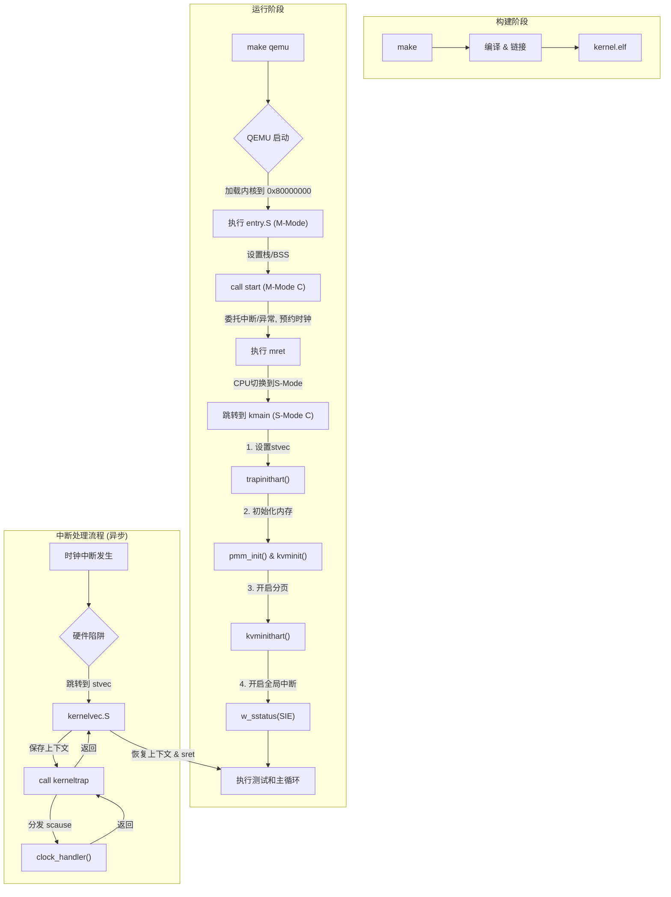

# riscv-os: 一个极简的RISC-V操作系统内核

**riscv-os** 是一个为教学目的而创建的、极简的操作系统内核。它基于 **RISC-V 64位架构**，能在 **QEMU virt** 模拟环境中启动。本内核清晰地展示了从硬件引导到C语言环境的完整流程，并实现了一个功能丰富的格式化输出系统。

这个项目的核心目标是让学习者深入理解操作系统的引导过程、分层设计思想、以及内核与硬件交互的基本原理。

---

## ✨ 功能特性
- **平台**: RISC-V (RV64GC)
- **目标机器**: QEMU virt machine
- **语言**: C 和 RISC-V 汇编

### 核心功能
- **完整启动链**: 实现了从汇编入口(`entry.S`)到C语言主函数(`kmain`)的完整引导流程。
- **C语言环境**: 建立了基本的C语言运行时环境，包括设置栈指针和清零BSS段。
- **分层输出系统**: 构建了 `printf` -> `console` -> `uart` 的三层解耦输出架构。
- **格式化输出**: 实现了功能丰富的`printf`，支持 `%d`, `%x`, `%p`, `%s`, `%c` 及 `%%` 等常用格式。
- **虚拟内存**: 实现了基于Sv39规范的三级页表，支持内核空间的虚拟地址映射。
- **错误处理**: 设计了一个基本的`panic`致命错误处理机制。

### 中断与特权级
- **M/S特权级分离**: 内核引导程序运行在M-Mode，负责硬件初始化与中断委托；内核主体运行在S-Mode，负责核心逻辑。
- **陷阱(Trap)处理框架**: 建立了统一的中断/异常处理入口(`kernelvec`)，能够进行上下文的精确保存与恢复。
- **中断分发**: C语言中断处理函数(`kerneltrap`)能够根据`scause`寄存器分发中断和异常。
- **时钟中断**: 成功实现了由硬件时钟驱动的周期性中断，证明了事件驱动模型正常工作。

---

## 🛠️ 环境依赖
在开始之前，请确保你已经安装了以下工具：

- **RISC-V 交叉编译工具链**: `riscv64-unknown-elf-gcc`
- **QEMU 模拟器**: `qemu-system-riscv64`
- **GNU Make**

在 Ubuntu/Debian 系统中，你可以通过以下命令安装：
```bash
sudo apt-get update
sudo apt-get install build-essential git gcc-riscv64-unknown-elf qemu-system-misc
````

-----

## 🚀 如何编译和运行

1.  **克隆或下载项目**

<!-- end list -->

```bash
git clone [https://github.com/ABChaha11/my_os.git](https://github.com/ABChaha11/my_os.git)
cd riscv-os
```

2.  **编译内核** 在项目根目录下执行 `make` 命令。

<!-- end list -->

```bash
make
```

该命令会编译所有源文件并链接生成 `kernel/kernel.elf` 内核镜像。

3.  **在 QEMU 中运行**
    执行 `make qemu` 命令。

<!-- end list -->

```bash
make qemu
```

你将会观察到一个动态的输出过程，展示了从M-Mode到S-Mode的切换以及中断的正常工作：

**预期的最终终端输出**将会是：

```
--- riscv-os Kernel Booting ---
trapinithart: stvec set to 0x80001830
pmm: initializing...
pmm: managing memory from 0x80003000 to 0x88000000
pmm: initialization complete.
kvminit: creating kernel page table...
kvminit: mapped uart (0x10000000)
kvminit: mapped kernel text [0x80000000, 0x8000188e)
kvminit: mapped kernel data and ram [0x80002000, 0x88000000)
kvminit: kernel page table created successfully.
kvminithart: virtual memory enabled.
kmain: S-Mode interrupts enabled.


Screen cleared.


--- Running Tests ---
--- Testing Basic Cases ---
Testing integer: 42
Testing negative: -123
Testing zero: 0
Testing hex: 0xabc
Testing pointer: 0x80000000
Testing string: Hello World!
Testing char: X
Testing percent: %
Multiple args: Number 123, 0x7b

--- Testing Edge Cases ---
INT_MAX: 2147483647
INT_MIN: -2147483648
UINT_MAX (hex): 0xffffffff
NULL string: (null)
Empty string: 


--- Testing PMM ---
  alloc_page() -> 0x87fbb000
  alloc_page() -> 0x87fba000
  free_page(0x87fbb000)
  alloc_page() -> 0x87fbb000
  PMM test passed.
--- Testing VM ---
  Kernel text mapping OK.
  Kernel data mapping OK.
  UART mapping OK.
  VM test passed.

--- Testing Timer Interrupt ---
  (ticks 会在后台由中断自动增加)
  Timer test passed (ticks = 8).

--- All tests passed! ---
Kernel is now halting.
tick 100
tick 200
tick 300
...
```
注意: 最后持续打印的 tick ... 信息是在内核主程序停机后，由时钟中断在后台独立驱动的，这证明了中断系统已成功运行。

4.  **清理生成文件**

<!-- end list -->

```bash
make clean
```

-----

## 📁 项目结构

```
riscv-os/
├── kernel/
│   ├── entry.S        # M-Mode汇编入口：设置初始栈、清零BSS、跳转到M-Mode C
│   ├── start.c        # M-Mode C代码：负责中断委托、PMP配置，并通过mret切换到S-Mode
│   ├── kernelvec.S    # S-Mode汇编入口：中断/异常的统一入口，负责上下文保存与恢复
│   ├── trap.c         # S-Mode C代码：中断/异常的总分发与处理逻辑
│   ├── kernel.ld      # 链接器脚本：定义内核内存布局
│   ├── main.c         # S-Mode C主函数(kmain)：内核逻辑与测试
│   ├── uart.c         # 硬件抽象层：串口驱动
│   ├── console.c      # 控制台层：封装串口，处理特殊序列
│   ├── printf.c       # 格式化层：实现printf
│   ├── pmm.c          # 物理内存管理器
│   └── vm.c           # 虚拟内存(页表)管理器
├── include/
│   ├── uart.h
│   ├── console.h
│   ├── printf.h
│   ├── pmm.h
│   ├── vm.h
│   ├── trap.h         # 中断陷阱相关声明
│   ├── riscv.h        # RISC-V CSR/分页宏定义
│   ├── memlayout.h    # 内存布局常量
│   ├── types.h        # 基本类型定义
│   ├── param.h        # 内核参数定义
│   └── defs.h         # 内核函数声明
├── Makefile           # 自动化构建脚本
└── README.md          # 本文档
```

-----

## 🔬 工作原理解析

本内核的启动与运行是一条精心设计的、跨越M/S特权级的事件驱动执行链，展示了软件如何逐步掌控硬件：

1.  **链接 (kernel.ld)**
    `Makefile` 调用链接器 `ld`，并根据 `kernel.ld` 的指示，将所有编译好的代码和数据打包成 `kernel.elf`。`kernel.ld` 定义了内核的基地址（`0x80000000`）、段的内存布局（如 `.text`, `.rodata`, `.data`），并提供了诸如 `etext`（代码段结束）、`erodata`（只读数据段结束）等关键地址符号，供内核在运行时进行精确的内存映射。

2.  **M-Mode引导 (entry.S -> start.c)**
    QEMU 将内核加载到 `0x80000000` 并开始执行。此阶段完全运行在最高特权级——**机器模式（M-Mode）**下，其唯一目标是为S-Mode内核准备一个安全且配置正确的环境。
    - **`entry.S`**: 作为硬件启动后的第一个入口点，它只负责两件最基础的工作：设置一个临时的M-Mode栈指针（`sp`），以及清零BSS段。随后，它将控制权移交给M-Mode的C函数 `start()`。
    - **`start.c`**: 这是**M-Mode的配置中心**。它负责执行一系列特权操作，为S-Mode铺平道路：
        - **委托(Delegate)**: 通过设置`medeleg`和`mideleg`寄存器，将所有S-Mode和U-Mode需要处理的中断和异常都委托给S-Mode。这是实现高性能中断处理的关键。
        - **配置(Configure)**: 设置PMP（物理内存保护）以允许S-Mode访问全部内存；通过`menvcfg`授权S-Mode访问时钟寄存器，解决了我们在调试中遇到的非法指令问题。
        - **预约(Arm)**: 调用`timerinit`，通过写`stimecmp`寄存器，预约了第一次S-Mode时钟中断。
        - **切换(Switch)**: 设置`mepc`指向S-Mode的入口函数`kmain`，并将`mstatus.MPP`位设为S-Mode，最后执行`mret`指令。CPU通过这一指令，原子地将控制权和特权级移交给S-Mode。

3.  **S-Mode执行与初始化 (main.c)**
    `kmain()` 函数是**监管者模式（S-Mode）**的C语言入口，也是内核高级逻辑的起点。它的初始化顺序经过精心设计，以规避我们在调试中遇到的各种时序竞争和页表映射陷阱：
    - **中断准备**: `kmain`做的第一件事就是调用`trapinithart()`，将`stvec`寄存器指向S-Mode的汇编入口`kernelvec`。这确保了在任何中断（尤其是M-Mode预约的那个时钟中断）到来之前，我们都有一个合法的处理程序入口。
    - **硬件与内存初始化**: 依次调用 `uart_init()`, `pmm_init()`, `kvminit()`，完成串口、物理内存和虚拟内存页表的初始化。
    - **虚拟内存激活**: 调用`kvminithart()`，将页表地址写入`satp`寄存器并刷新TLB。从此刻起，CPU正式在分页模式下运行，所有地址都成为虚拟地址。
    - **中断使能**: 在所有准备工作万无一失后，通过设置`sstatus.SIE`位，开启S-Mode的全局中断。至此，内核已准备好响应来自硬件的异步事件。

4.  **陷阱(Trap)处理系统 (trap.c -> kernelvec.S)**
    这是内核从被动执行转为事件驱动的核心，是一个由硬件和软件协同工作的流程：
      - **硬件陷阱**: 当时钟中断或异常（如缺页）发生时，CPU硬件会自动保存当前PC到`sepc`，记录原因到`scause`，然后强制跳转到`stvec`指向的地址——`kernelvec.S`。
      - **`kernelvec.S` (上下文守护者)**: 作为S-Mode所有陷阱的唯一汇编入口，它不关心陷阱的原因，只负责一件核心任务：**保存上下文**。它将所有调用者保存的通用寄存器（`ra`, `t0-t6`, `a0-a7`等）压入当前内核栈，然后调用C语言的总处理函数`kerneltrap`。
      - **`trap.c` (C语言分发器)**: `kerneltrap`函数通过读取`scause`寄存器来判断事件类型（中断还是异常），然后调用具体的处理函数，例如`clock_handler`或`exception_handler`。
      - **返回流程**: C函数处理完毕后返回`kernelvec.S`，后者再从栈中按相反顺序**恢复上下文**，最后执行`sret`指令。`sret`会原子地恢复PC和`sstatus`，使程序从被中断的地方无缝地继续执行。

5.  **核心功能模块**
    - **内存管理系统 (pmm.c -> vm.c)**: 这是一个经典的两层架构。
        - **物理内存管理器 (pmm.c)**: 作为最底层，它通过一个高效的侵入式链表来管理所有空闲的4KB物理页面，提供 `alloc_page()` 和 `free_page()` 接口。
        - **虚拟内存管理器 (vm.c)**: 它构建在PMM之上，负责创建和管理符合Sv39规范的页表。`kvminit`函数为内核的`.text`(R-X)、`.rodata`(R--)和`.data`/RAM(RW-)等区域建立了精确的、无重叠的内存映射。
    - **输出系统 (printf.c -> console.c -> uart.c)**: 这是一个三层解耦架构。
        - **格式化层 (printf.c)**：负责解析格式字符串并将各种数据类型转换为字符流。
        - **控制台层 (console.c)**：提供了一个抽象的“控制台”概念，未来可以方便地扩展到支持其他输出设备。
        - **硬件抽象层 (uart.c)**：通过内存映射I/O（MMIO）直接与串口硬件交互，发送单个字符。

-----

## 🔗 系统流程示意图

