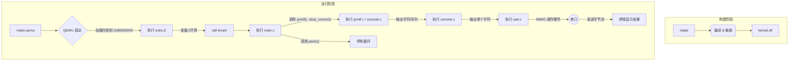

# riscv-os: 一个极简的RISC-V操作系统内核

**riscv-os** 是一个为教学目的而创建的、极简的操作系统内核。它基于 **RISC-V 64位架构**，能在 **QEMU virt** 模拟环境中启动。本内核清晰地展示了从硬件引导到C语言环境的完整流程，并实现了一个功能丰富的格式化输出系统。

这个项目的核心目标是让学习者深入理解操作系统的引导过程、分层设计思想、以及内核与硬件交互的基本原理。

---

## ✨ 功能特性
- **平台**: RISC-V (RV64GC)
- **目标机器**: QEMU virt machine
- **语言**: C 和 RISC-V 汇编

### 核心功能
- **完整启动链**: 实现了从汇编入口(`entry.S`)到C语言主函数(`kmain`)的完整引导流程。
- **C语言环境**: 建立了基本的C语言运行时环境，包括设置栈指针和清零BSS段。
- **分层输出系统**: 构建了 `printf` -> `console` -> `uart` 的三层解耦输出架构。
- **格式化输出**: 实现了功能丰富的`printf`，支持 `%d`, `%x`, `%p`, `%s`, `%c` 及 `%%` 等常用格式。
- **终端控制**: 实现了基于ANSI转义序列的清屏功能。
- **底层驱动**: 包含一个最小化的、基于轮询的串口驱动（NS16550A UART）。
- **错误处理**: 设计了一个基本的`panic`致命错误处理机制。

---

## 🛠️ 环境依赖
在开始之前，请确保你已经安装了以下工具：

- **RISC-V 交叉编译工具链**: `riscv64-unknown-elf-gcc`
- **QEMU 模拟器**: `qemu-system-riscv64`
- **GNU Make**

在 Ubuntu/Debian 系统中，你可以通过以下命令安装：
```bash
sudo apt-get update
sudo apt-get install build-essential git gcc-riscv64-unknown-elf qemu-system-misc
````

-----

## 🚀 如何编译和运行

1.  **克隆或下载项目**

<!-- end list -->

```bash
git clone [https://github.com/ABChaha11/my_os.git](https://github.com/ABChaha11/my_os.git)
cd riscv-os
```

2.  **编译内核** 在项目根目录下执行 `make` 命令。

<!-- end list -->

```bash
make
```

该命令会编译所有源文件并链接生成 `kernel/kernel.elf` 内核镜像。

3.  **在 QEMU 中运行**
    执行 `make qemu` 命令。

<!-- end list -->

```bash
make qemu
```

你将会观察到一个动态的输出过程：

1.  终端屏幕首先会**被清空**。
2.  然后打印出 `Screen cleared.` 等初始信息。
3.  在短暂的**延时**后，开始逐一打印`printf`的各项测试结果。
4.  所有测试完成后，系统会调用`panic`并停机。

**预期的最终终端输出**将会是：

```
Screen cleared.

--- Testing Basic Cases ---
Testing integer: 42
Testing negative: -123
Testing zero: 0
Testing hex: 0xabc
Testing pointer: 0x80000000
Testing string: Hello World!
Testing char: X
Testing percent: %
Multiple args: Number 123, 0x7b

--- Testing Edge Cases ---
INT_MAX: 2147483647
INT_MIN: -2147483648
UINT_MAX (hex): 0xffffffff
NULL string: (null)
Empty string: 

All tests finished.
Kernel is now halting.
```

4.  **清理生成文件**

<!-- end list -->

```bash
make clean
```

-----

## 📁 项目结构

```
riscv-os/
├── kernel/
│   ├── entry.S        # 汇编入口：设置栈、清零BSS、跳转到C
│   ├── kernel.ld      # 链接器脚本：定义内核内存布局
│   ├── main.c         # C语言主函数(kmain)：内核逻辑与测试
│   ├── uart.c         # 硬件抽象层：串口驱动
│   ├── console.c      # 控制台层：封装串口，处理特殊序列
│   └── printf.c       # 格式化层：实现printf
├── include/
│   ├── uart.h         # 串口驱动头文件
│   ├── console.h      # 控制台层头文件
│   └── printf.h       # 格式化层头文件
├── Makefile           # 自动化构建脚本
└── README.md          # 本文档
```

-----

## 🔬 工作原理解析

本内核的启动与输出过程是一条清晰的分层执行链，展示了软件如何逐步掌控硬件：

1.  **链接 (kernel.ld)** `Makefile` 调用链接器 `ld`，并根据 `kernel.ld` 的指示，将所有编译好的代码和数据打包成 `kernel.elf`。它定义了内核的基地址、段的内存布局以及供运行时使用的关键地址符号。

2.  **汇编入口 (kernel/entry.S)** QEMU 将内核加载到 `0x80000000` 并开始执行。此汇编代码负责为C语言的运行准备好舞台：**设置栈指针 (sp)** 和 **清零BSS段**。完成后，通过 `call kmain` 将控制权移交给C语言。

3.  **C语言主函数 (main.c)** `kmain` 函数是内核高级逻辑的起点。在当前版本中，它作为测试驱动程序，按顺序调用 `clear_screen()` 和 `printf()` 的各项测试用例，以验证整个输出系统的功能。

4.  **输出系统 (printf.c -\> console.c -\> uart.c)** 这是一个三层架构：

      - **格式化层 (printf.c)**：最高层。负责解析格式字符串（如 `%d`），处理可变参数，并将整数、指针等数据类型转换为字符流。它调用下一层来输出这些字符。
      - **控制台层 (console.c)**：中间层。它提供了一个更抽象的“控制台”概念。它接收来自上层的字符流，并负责处理特殊的控制序列，例如将`clear_screen()`函数调用转换为实际发送给终端的ANSI转义代码。
      - **硬件抽象层 (uart.c)**：最底层。它直接与硬件打交道，通过 **内存映射I/O (MMIO)** 的方式，将单个字符字节写入UART硬件寄存器，完成物理上的数据发送。

-----

## 🔗 系统流程示意图



```
```