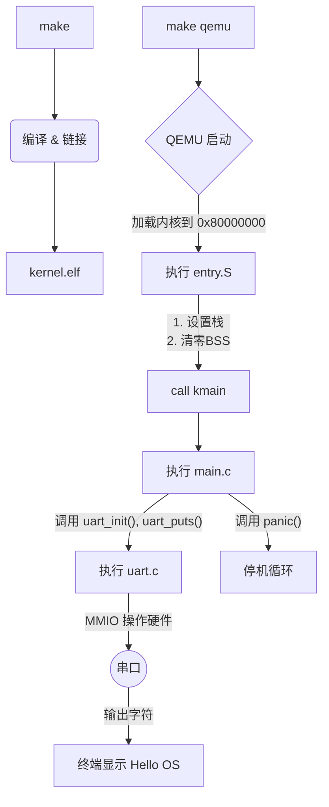

# riscv-os: 一个极简的RISC-V操作系统内核

**riscv-os** 是一个为教学目的而创建的、极简的操作系统内核。它基于 **RISC-V 64位架构**，能在 **QEMU virt** 模拟环境中启动，并最终通过串口输出：

```
Hello OS
```

这个项目的核心目标是清晰地展示操作系统从零开始的完整引导过程（Bootstrap），包括从汇编入口到C语言环境的建立，以及与硬件进行最基本的交互。

---

## ✨ 功能特性
- **平台**: RISC-V (RV64GC)
- **目标机器**: QEMU virt machine
- **语言**: C 和 RISC-V 汇编

### 核心功能
- 实现了从汇编到C语言的启动流程
- 建立了基本的C语言运行时环境（栈指针、BSS段清零）
- 包含一个最小化的、基于轮询的串口驱动（NS16550A UART）
- 能够向串口控制台输出字符串
- 设计了一个基本的 panic 致命错误处理机制

---

## 🛠️ 环境依赖
在开始之前，请确保你已经安装了以下工具：

- **RISC-V 交叉编译工具链**: 用于编译生成RISC-V架构的可执行文件。
  - `riscv64-unknown-elf-gcc`
  - `riscv64-unknown-elf-ld`
- **QEMU 模拟器**: 用于运行我们的内核。
  - 需要 `qemu-system-riscv64`
- **GNU Make**: 用于自动化构建项目。

在 Ubuntu/Debian 系统中，你可以通过以下命令安装：
```bash
sudo apt-get update
sudo apt-get install build-essential git gcc-riscv64-unknown-elf qemu-system-misc
```

---

## 🚀 如何编译和运行
1. 克隆或下载项目
```bash
git clone <your-repo-url>
cd riscv-os
```

2. 编译内核  
在项目根目录下执行：
```bash
make
```

如果一切顺利，你会在 `kernel/` 目录下看到一个名为 `kernel.elf` 的内核镜像文件。

3. 在 QEMU 中运行
```bash
make qemu
```

你将会在终端看到以下输出：
```
Hello OS from riscv-os!
PANIC: End of boot test
```

这个输出表明内核已成功启动，打印了欢迎信息，并成功测试了 panic 错误处理机制。

4. 清理生成文件
```bash
make clean
```

---

## 📁 项目结构
```
riscv-os/
├── kernel/
│   ├── entry.S        # 汇编入口：设置栈、清零BSS、跳转到C
│   ├── kernel.ld      # 链接器脚本：定义内核内存布局
│   ├── main.c         # C语言主函数(kmain)：内核逻辑主体
│   └── uart.c         # 串口驱动：实现硬件通信
├── include/
│   └── uart.h         # 串口驱动的头文件
├── Makefile           # 自动化构建脚本
└── README.md          # 本文档
```

---

## 🔬 工作原理解析
本内核的启动过程是一条清晰的执行链，展示了软件如何逐步掌控硬件：

1. **链接 (kernel.ld)**  
   Makefile 调用链接器 `ld`，并根据 `kernel.ld` 的指示，将所有编译好的代码和数据打包成 `kernel.elf`。  
   - 指定内核的基地址为 `0x80000000`  
   - 定义 `.text`, `.data`, `.bss` 等段的内存布局  
   - 导出 `_bss_start`, `_bss_end`, `_end` 等关键地址符号，供运行时使用。

2. **汇编入口 (kernel/entry.S)**  
   QEMU 将内核加载到 `0x80000000` 并开始执行，CPU的第一站是 `_start` 标签。此汇编代码执行两项关键任务：
   - **设置栈指针 (sp)**：在内核镜像的末尾 (`_end` 符号之后) 分配 4KB 空间作为栈，并将 `sp` 指向其顶部。
   - **清零 BSS 段**：根据 `_bss_start` 和 `_bss_end` 符号，将 `.bss` 段对应的内存区域全部写入0。

   完成上述准备后，它通过 `call kmain` 指令，将控制权移交给C语言世界。

3. **C语言主函数 (kernel/main.c)**  
   `kmain` 函数是内核高级逻辑的起点：
   - 调用 `uart_init()` 初始化串口设备
   - 调用 `uart_puts()` 通过串口发送字符串
   - 调用 `panic()` 打印错误信息并进入无限循环

4. **串口驱动 (kernel/uart.c)**  
   这是与硬件交互的底层实现：
   - 通过 **内存映射 I/O (MMIO)** 的方式，向 `0x10000000` 这个物理地址（QEMU virt 平台下 UART 的基地址）写入控制值来初始化串口
   - 通过轮询状态寄存器来发送每一个字符

---

## 🔗 启动流程示意图

