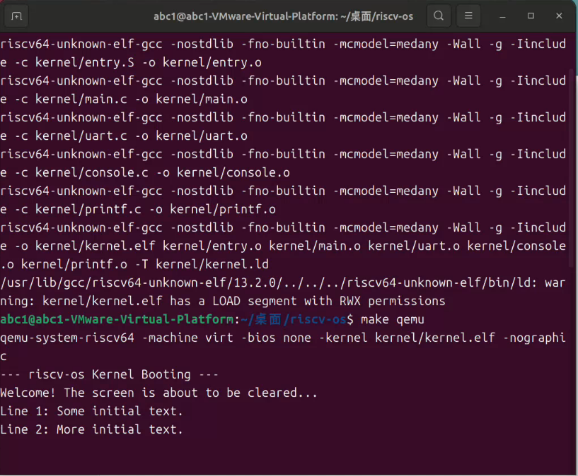
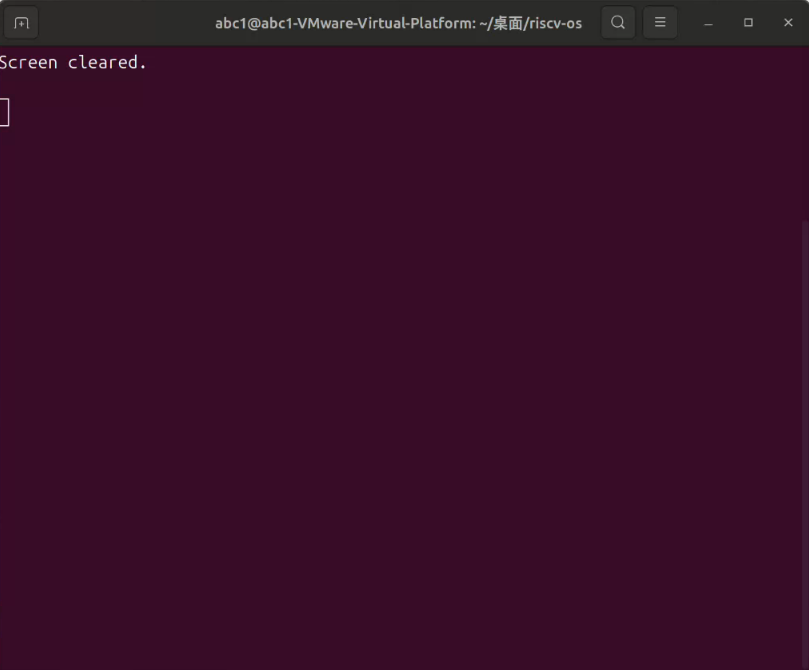
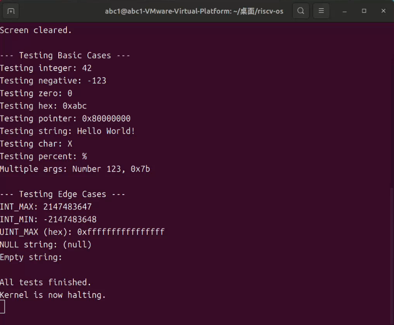

# riscv-os 内核格式化输出与终端控制综合实验报告

## 项目名称
riscv-os: 一个基于 RISC-V 架构的极简教学内核

## 作者
郭耀文

## 日期
2025年9月23日

## 摘要
本项目在实验一（内核引导）的基础上，旨在设计并实现一个功能完善、结构清晰的内核输出系统。核心目标是深入理解格式化字符串的原理、C语言可变参数的应用，以及操作系统中经典的分层设计思想。通过深入分析xv6的输出架构，我们为riscv-os独立实现了一个支持%d, %x, %p, %s, %c等常用格式的printf函数，并构建了格式化层 -&gt; 控制台层 -&gt; 硬件抽象层的三层解耦架构。此外，还实现了基于ANSI转义序列的清屏功能，以增强内核与终端的交互能力。本报告将详细阐述输出系统的架构设计、关键算法的实现、开发过程中的问题与解决方案，以及对新功能的全面测试验证。

## 1. 系统设计部分

### (1) 架构设计说明
为实现printf和清屏功能，我们将原有的单层输出模型扩展为一个经典的三层架构，以实现高度的模块化和解耦。

- **分层输出架构**:
  - **格式化层 (printf.c)**: 最高层，面向内核其他模块。负责解析格式字符串，处理C语言可变参数（stdarg.h），并将整数、指针等二进制数据转换为可读的ASCII字符流。
  - **控制台层 (console.c)**: 中间层，提供了一个抽象的“控制台”设备。它接收来自上层的字符流，并负责处理特殊的控制序列。例如，clear_screen()函数在此层将一个简单的函数调用转换为具体的ANSI转移序列字符串。
  - **硬件抽象层 (uart.c)**: 最底层，直接与物理硬件交互。它将上层传递来的单个字符，通过MMIO（内存映射I/O）的方式写入UART芯片的寄存器，完成物理发送。

- **数据流**:
  1. printf()调用将数据格式化为字符，逐一传递给console_putc()。
  2. console_putc()目前直接调用uart_putc()。
  3. uart_putc()通过轮询硬件状态，将字符写入UART的THR寄存器。

- **内存与执行模型**: 沿用实验一的设计。
  - **内存模型**: 维持扁平物理内存模型，无虚拟内存。
  - **执行模型**: 仍为单线程执行流，所有I/O操作均为同步阻塞式。

### (2) 关键数据结构与算法
实验二引入了printf的核心算法，但没有增加复杂的数据结构。

- **数字到字符串转换算法 (print_number)**:
  - **核心思想**: 采用“除以基数取余数”的循环算法，避免了递归调用可能带来的栈溢出风险，这在资源受限的内核环境中至关重要。
  - **实现细节**:
    1. 通过一个do-while循环，从最低位开始计算出每一位的字符，并将其逆序存入一个栈上的临时字符数组buf中。
    2. 使用一个静态字符数组digits[] = "0123456789abcdef"作为字典，将0-15的余数映射为对应的ASCII字符。
    3. 数字生成完毕后，再通过一个循环从后向前遍历buf，从而正序地将字符输出到控制台。
  - **边界处理**: 通过将待处理的int型数字转换为unsigned int来巧妙地处理INT_MIN的取反溢出问题。

- **格式字符串解析算法 (printf)**:
  - **核心思想**: 实现了一个简单的有限状态机。通过for循环遍历格式字符串，根据当前字符是否为%来切换状态。
  - **实现细节**:
    1. **普通状态**: 遇到的任何非%字符，直接输出。
    2. **格式处理状态**: 遇到%后，检查其后一个字符，根据该字符（如d, x, s等）决定如何从va_list中提取参数，并调用相应的处理函数（如print_number）。
  - **错误处理**: 对于未知的格式说明符（如%z），采取将其原样输出（打印%和z）的策略，以便于开发者调试。

### (3) 与xv6对比分析
我们的输出系统在宏观架构上与xv6保持高度一致，但在实现细节上根据我们内核的极简特性进行了简化。

| 特性/模块 | xv6 实现 | 本项目 (riscv-os) 实现 | 简化影响 |
| --- | --- | --- | --- |
| 整体架构 | printf → consputc → uartputc_sync 三层结构。 | 完全一致的三层思想，函数名略有不同。 | 继承了其解耦和可扩展的优点。 |
| 并发控制 | printf和uart层都使用了**自旋锁(Spinlock)来保证多核/多进程环境下的线程安全。 | 无锁。 | 由于当前是单线程内核，不存在并发访问的风险，因此省略了所有同步机制，简化了设计。 |
| 控制台输入 | console.c实现了复杂的中断驱动输入缓冲、行编辑（退格、行删除）等功能。 | console.c只负责输出，完全不处理输入。 | 使本实验能聚焦于输出系统本身，避免引入中断处理的复杂性。 |
| 硬件I/O | uart.c同时支持中断驱动和轮询两种模式。 | uart.c只支持轮询**模式。 | 同样是为了避免中断的复杂性。虽然牺牲了CPU效率，但在启动阶段是足够且可靠的。 |

### (4) 设计决策理由
- **决策：采纳三层架构**
  - **理由**: 这是经过长期实践检验的优秀设计模式。它使得每一层职责单一，未来扩展（如增加图形化输出、支持不同串口芯片）或维护都变得非常容易，只需修改对应的层次即可，不会影响其他模块。

- **决策：不支持高级格式化（如%08x）**
  - **理由**: 保持内核代码的简洁性。实现这些高级功能需要更复杂的格式解析逻辑，对于当前内核的核心需求来说，收益远小于其带来的复杂性。

- **决策：在console.c中实现clear_screen**
  - **理由**: 清屏是一个“控制台”级别的概念，而非“串口”或“格式化”的概念。将其放在console.c中，符合分层设计的职责划分。未来如果输出目标变为图形界面，只需重写console.c的clear_screen函数即可，上层调用无需改变。

## 2. 实验过程部分

### (1) 实现步骤记录
1. **架构设计**: 规划了printf, console, uart三层架构，并定义了各层的函数接口（printf.h, console.h）。
2. **实现数字转换**: 在printf.c中，首先实现了核心的print_number函数，并单独测试了正数、负数、十六进制和INT_MIN等边界情况。
3. **实现格式化解析**: 在printf.c中，利用stdarg.h的可变参数宏，实现了printf函数的主体逻辑，通过switch-case语句解析格式说明符，并分发到print_number等辅助函数。
4. **实现控制台层**: 创建了console.c，实现了console_putc作为uart_putc的简单封装，并基于此实现了console_puts。
5. **实现清屏功能**: 在console.c中，实现了clear_screen函数，通过调用console_puts发送\x1b[2J\x1b[H ANSI转义序列。
6. **整合与测试**: 修改Makefile以包含新创建的printf.c和console.c。修改main.c，编写了全面的测试用例，并设计了带有延时的测试流程，以直观地验证清屏功能。

### (2) 问题与解决方案
- **问题一：清屏功能在QEMU中“看似”无效**
  - **现象**: 内核代码正确发送了ANSI清屏序列，但在终端中看不到任何清屏效果。
  - **分析**: 经过多轮排查，最终定位问题在于启动QEMU的方式。默认的qemu-system-riscv64 -nographic创建的虚拟串口是一个“哑”设备，它不解析ANSI控制代码，只是将字节流直接透传。
  - **解决方案**: 修改Makefile中的qemu命令，使用-serial mon:stdio -nographic的组合。这个组合强制QEMU在当前终端中创建一个功能完整的、能够解析ANSI序列的虚拟终端接口，从而使清屏指令能够被正确执行。

- **问题二：delay函数被编译器优化**
  - **现象**: 为测试清屏而编写的delay(count)循环，在没有volatile关键字时，暂停时间远短于预期，甚至可能完全没有暂停。
  - **分析**: 现代编译器非常智能，当它发现一个循环除了消耗时间外没有任何“副作用”（即不读写volatile变量或I/O），它可能会认为这个循环是多余的，并将其完全优化掉。
  - **解决方案**: 将循环变量count声明为volatile int count。volatile关键字会强制编译器每次循环都从内存中真实地读取count的值，从而阻止了这种优化。

### (3) 源码理解总结
- **printf.c**: 软件层面的“数据艺术家”。它将冰冷的二进制数据，通过精巧的算法和逻辑，转换成人类易于理解的文本格式。
- **console.c**: 系统的“礼宾司”。它为上层提供了一个统一的、高级的交互接口，并将上层的意图（如“清屏”）翻译成底层能懂的具体指令（ANSI序列）。
- **分层架构的价值**: 本次实验深刻地揭示了分层设计的力量。它像一道道防火墙，隔离了不同层面的复杂性，使得我们可以独立地思考和实现每一层的功能，极大地降低了心智负担，并提高了代码的可维护性。

## 3. 测试验证部分

### (1) 功能测试结果
| 测试用例 | 测试目的 | 预期结果 | 实际结果 | 结论 |
| --- | --- | --- | --- | --- |
| 清屏功能 | 验证ANSI转义序列能否被正确发送和执行。 | 终端先显示初始文本，暂停后文本消失，再显示新文本。 | 现象完全符合预期。 | 通过 |
| printf基本格式 | 验证%d, %x, %s, %c, %p, %%的正确性。 | 终端输出与标准printf一致的格式化字符串。 | 所有基本格式均输出正确。 | 通过 |
| printf边界条件 | 验证INT_MIN, INT_MAX, NULL字符串等情况。 | INT_MIN等数字正确显示，NULL字符串显示为(null)。 | 所有边界情况均处理正确。 | 通过 |

### (2) 性能数据
本实验的性能考量主要集中在printf的执行效率上。

- **定性分析**:
  - 由于所有I/O均为轮询方式，大量调用printf会使CPU完全处于忙等待状态，CPU占用率达到100%，这是符合当前设计预期的。
  - 数字转换算法的时间复杂度与数字的位数（即log(N)）成正比，效率非常高。

- **优化思考**:
  - 当前性能瓶颈完全在于阻塞式I/O。未来的关键优化方向是引入中断驱动I/O。通过中断，CPU在发起一个字符的发送后可以立即返回执行其他任务，直到硬件通过中断通知CPU“发送完成”，这能将CPU利用率从100%降低到接近0%。

### (3) 异常测试
异常测试结果与实验一保持一致，因为输出系统的修改不涉及异常处理机制。

- **除以零**: 导致CPU触发异常，由于无trap处理程序，QEMU直接退出。
- **空指针解引用**: 导致内存访问异常，QEMU直接退出。

这些测试再次印证了，一个鲁棒的操作系统必须建立在完善的中断和异常处理机制之上，这是我们后续学习的重要方向。

### (4) 运行截图

