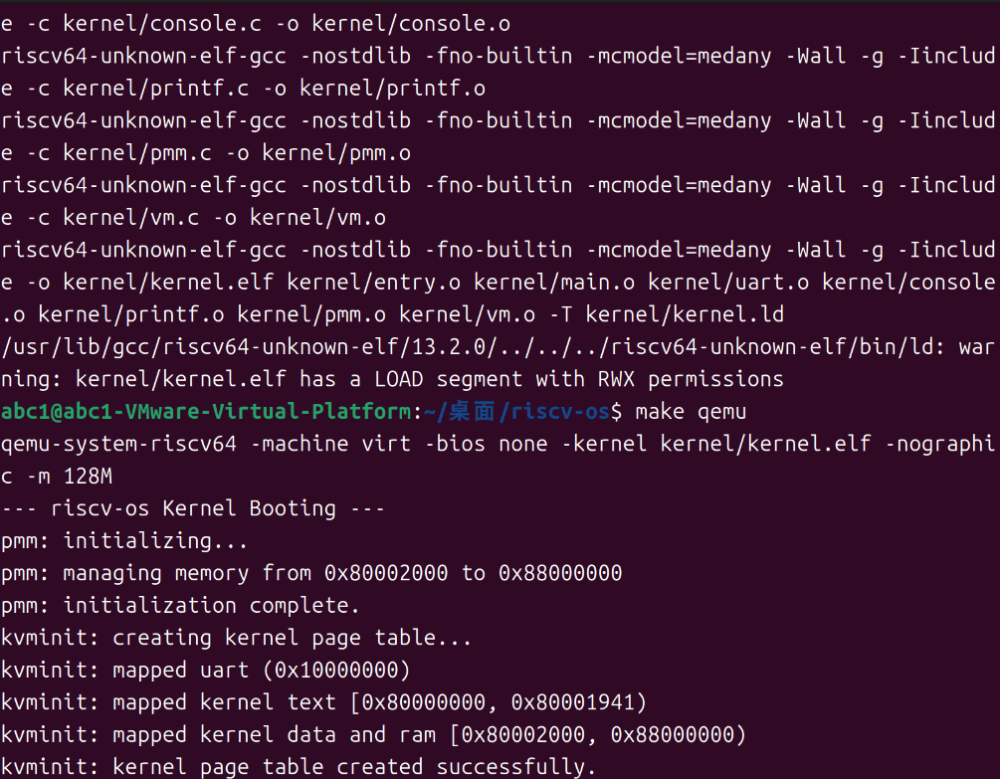
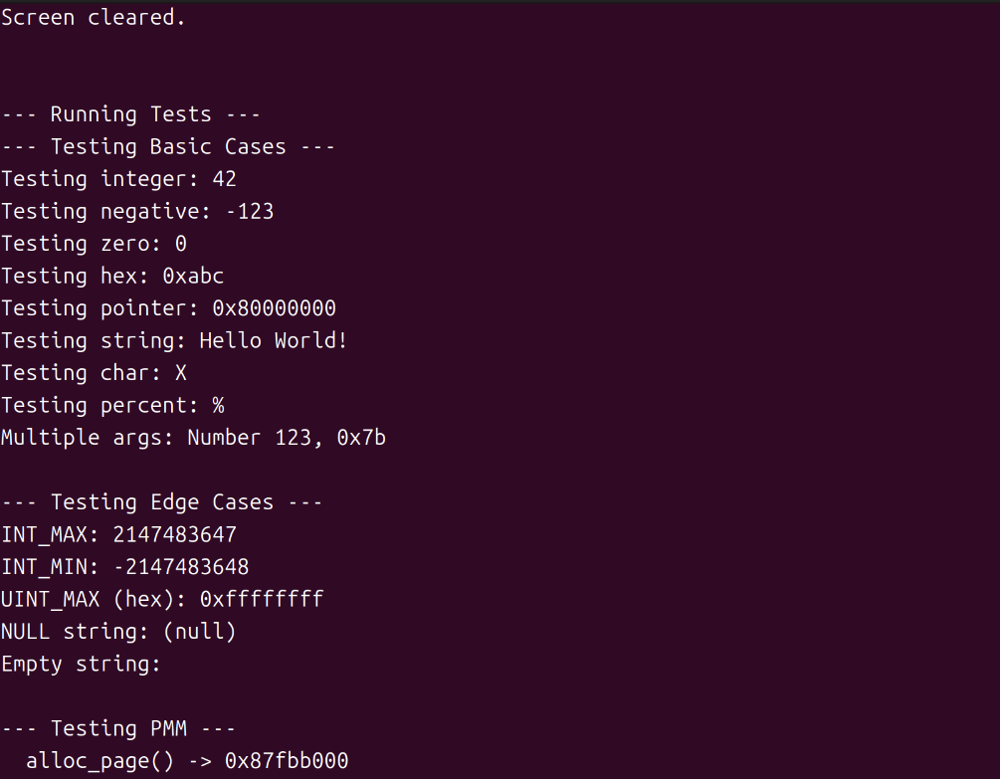
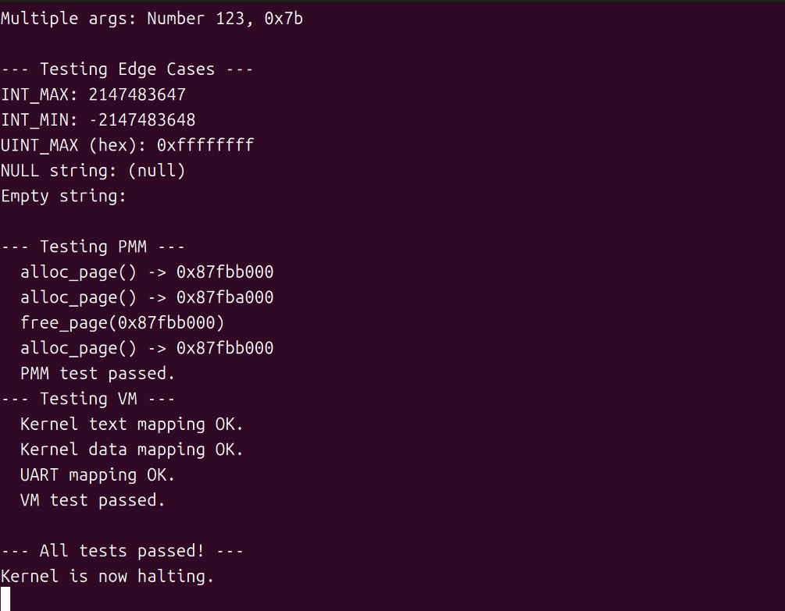

# riscv-os 内核页表与虚拟内存综合实验报告

## 项目名称
riscv-os: 一个基于 RISC-V 架构的极简教学内核

## 作者
郭耀文

## 日期
2025年10月14日

## 摘要
本项目在前序实验的基础上，实现了操作系统最为核心的功能之一：虚拟内存管理。核心目标是通过从零开始构建一个页式内存管理系统，深入理解物理内存的组织、页表的原理以及CPU如何从物理地址模式切换到虚拟地址模式。我们首先设计并实现了一个基于侵入式空闲链表的物理内存分配器（PMM）。随后，基于PMM，我们构建了一套符合RISC-V Sv39分页规范的页表管理系统（VM），并为内核创建了完整的内存映射。最终，通过配置`satp`寄存器，成功激活了分页机制，使内核后续的所有操作都运行在虚拟地址之上。本报告将详细阐述内存管理系统的分层架构设计、关键算法实现、开发过程中的挑战与解决方案，以及对新功能的全面测试验证。

## 1. 系统设计部分

### (1) 架构设计说明
为了实现虚拟内存，我们将内核的内存管理系统设计为一个经典的两层架构：

- **物理内存管理器 (PMM - `pmm.c`)**:
    - **职责**: 管理系统中所有的物理内存页（DRAM）。它是整个内存系统的基石。
    - **管理范围**: 从内核镜像结束地址 (`_end`) 之后，到物理内存顶部 (`PHYSTOP`) 之间的所有物理内存。
    - **核心功能**: 提供 `alloc_page()` 和 `free_page()` 两个原子操作接口，用于分配和释放单个4KB大小的物理页。
    - **设计哲学**: 保持极简与高效，不关心页面的用途，只负责管理其空闲与否。

- **虚拟内存管理器 (VM - `vm.c`)**:
    - **职责**: 负责页表的创建、修改和查询，建立虚拟地址到物理地址的映射关系。
    - **依赖**: VM的运行完全依赖于PMM。当需要创建新的页表页时，它会向PMM申请物理页。
    - **核心功能**: 实现了 `kvminit()` 用于创建内核页表，`kvminithart()` 用于激活分页，以及 `map_page()`、`walk_lookup()` 等核心页表操作函数。
    - **映射方案**: 内核采用**恒等映射 (Identity Mapping)**，即内核空间的虚拟地址与物理地址相同，简化了内核设计。

- **地址翻译流程**:
    1.  内核代码需要访问一个虚拟地址 `va`。
    2.  CPU的MMU从 `satp` 寄存器获取根页表的物理地址。
    3.  MMU根据 `va` 的高27位（分为三级9位索引）自动地、硬件地在物理内存中进行**页表遍历 (Page Walk)**。
    4.  找到最终的页表项（PTE），从中提取出物理页号（PPN）。
    5.  将PPN与 `va` 的低12位偏移组合，形成最终的物理地址 `pa`。
    6.  CPU访问物理地址 `pa`。

### (2) 关键数据结构
- **`struct page_info` (`pmm.c`)**:
    ```c
    struct page_info {
        struct page_info *next;
    };
    ```
    - **设计**: 采用**侵入式链表**节点。当一个物理页空闲时，其开头的8个字节被用作 `next` 指针，指向下一个空闲页。
    - **优点**: 极大地节省了空间，无需任何额外的元数据来管理空闲页，整个空闲链表“寄生”在空闲页本身之上。

- **页表 (`pagetable_t`)**:
    - **定义**: `typedef uint64_t* pagetable_t;`
    - **本质**: 一个包含512个页表项（PTE）的数组，正好占用一个4KB的物理页。`pagetable_t` 本质上是一个指向这个数组的指针。

- **页表项 (`pte_t`)**:
    - **定义**: `typedef uint64_t pte_t;`
    - **结构**: 一个64位的整数，其位域由RISC-V Sv39规范严格定义，包括物理页号（PPN）、有效位（V）、权限位（R/W/X）、用户位（U）等。

### (3) 与xv6对比分析
我们的内存管理系统在设计哲学和核心实现上高度借鉴了xv6，但在当前阶段进行了简化。

| 特性/模块 | xv6 实现 | 本项目 (riscv-os) 实现 | 简化影响 |
| --- | --- | --- | --- |
| **物理内存分配 (PMM)** | `kalloc.c` 使用自旋锁保护 `freelist`，确保多核安全。 | `pmm.c` 无锁。 | 设计更简单，但目前是**非线程安全**的，未来扩展到多核时必须增加锁机制。 |
| **内核页表映射** | `kvminit()` 映射了PLIC、VirtIO等更多真实硬件设备。 | `kvminit()` 只映射了UART和RAM。 | 功能更少，但核心的内核映射逻辑完全一致，保留了可扩展性。 |
| **用户空间支持** | `vm.c` 包含大量处理用户进程页表的代码，如 `uvmcreate`, `uvmcopy`, `uvmunmap` 等。 | `vm.c` **完全没有**用户空间的概念，只服务于内核。 | 这是最大的简化。支持用户进程是后续实验的核心任务，需要在此基础上大量扩展。 |
| **写时复制(CoW)** | xv6的 `fork()` 系统调用实现了写时复制。 | 无。 | 缺乏高级内存管理特性，但CoW本身就建立在本次实验实现的页表权限控制之上。 |

### (4) 设计决策理由
- **决策：采用侵入式链表管理物理页**
    - **理由**: 这是内核设计中最经典、最高效的方案之一。在功能正确的前提下，它的空间开销为零，且分配/释放操作为O(1)，完美符合底层内存管理对性能和简洁性的要求。

- **决策：内核采用恒等映射**
    - **理由**: 使得内核在分页开启前后，访问自身代码和数据所使用的地址保持不变，极大地简化了内核的开发和调试。这是大多数宏内核操作系统的标准实践。

- **决策：暂不考虑并发安全**
    - **理由**: 当前内核是单线程模型。过早引入锁等多线程同步机制会不必要地增加复杂性。我们应该遵循演进式开发原则，在未来引入多任务调度时再来解决并发问题。

## 2. 实验过程部分

### (1) 实现步骤记录
1.  **规划与设计**: 确定了PMM+VM的两层架构，设计了 `pmm.h`, `vm.h`, `memlayout.h` 等头文件的接口和常量。
2.  **实现PMM**: 创建了 `pmm.c`，实现了 `pmm_init`, `alloc_page`, `free_page`。`pmm_init` 通过巧妙地调用 `free_page` 来初始化整个空闲链表。
3.  **实现VM**: 创建了 `vm.c`，核心是实现了 `walk_create` 函数，它能够按需分配页表页并完成三级页表的遍历。基于 `walk_create`，实现了 `map_page` 和 `map_region` 接口。
4.  **构建内核页表**: 在 `vm.c` 中实现了 `kvminit`，它调用 `map_region` 完成了对UART、内核代码段、数据段和所有RAM的恒等映射。
5.  **激活分页**: 实现了 `kvminithart`，通过写入`satp`寄存器和刷新TLB来正式启用虚拟内存。
6.  **整合与测试**:
    * 在 `Makefile` 中添加了新文件。
    * 在 `main.c` 的 `kmain` 函数中，按照 `pmm_init` -> `kvminit` -> `kvminithart` 的正确顺序进行调用。
    * 编写了 `test_pmm` 和 `test_vm` 两个测试函数，用于验证PMM的功能和内核页表在激活分页后是否正确建立。

### (2) 问题与解决方案
- **问题一：链接器错误 `undefined reference to 'etext'`**
    - **现象**: 编译通过，但在链接阶段报错，提示找不到 `etext` 符号。
    - **分析**: 我们在C代码中通过 `extern char etext[]` 引用了此符号，期望它代表内核代码段的结束，但忘记在链接器脚本 `kernel/kernel.ld` 中定义它。
    - **解决方案**: 在 `kernel.ld` 的 `.rodata` 段末尾，添加 `PROVIDE(etext = .);`，由链接器在链接时动态计算并提供该符号的地址。

- **问题二：启动后立即 `panic: map_page: address not page aligned`**
    - **现象**: 内核在 `kvminit` 过程中 panic。
    - **分析**: `etext` 的地址不是页对齐的。当 `kvminit` 尝试从 `etext` 开始映射数据段时，`map_region` 将这个未对齐的物理地址传递给了 `map_page`，导致其内部的对齐检查失败。
    - **解决方案**: 修正 `map_region` 的逻辑，确保传递给 `map_page` 的虚拟地址和物理地址都通过 `PGROUNDDOWN` 进行了严格的页对齐。

- **问题三：启动后 `panic: map_page: remap`**
    - **现象**: 内核在 `kvminit` 映射数据段时 panic。
    - **分析**: 这是上一个问题的延续。虽然对齐了地址，但 `etext` 向下对齐后，与代码段的最后一个页面发生了重叠，导致对同一个虚拟页面进行了两次映射。
    - **解决方案**: 修改 `kvminit` 中映射数据段的起始地址，从 `PGROUNDDOWN((uint64_t)etext)` 改为 `PGROUNDUP((uint64_t)etext)`，即从 `etext` 之后**第一个完整的新页面**开始映射数据段，彻底避免了重叠。

### (3) 源码理解总结
- **`pmm.c`**: 底层“会计”。它不关心内存用来做什么，只负责记录哪些页是空闲的，并快速地分配和回收它们。
- **`vm.c`**: 上层“规划师”。它向PMM申请“土地”（物理页），然后在上面绘制“城市规划图”（页表），定义了虚拟世界的地址布局和访问规则。
- **`main.c` (`kmain`)**: “总指挥”。它严格按照逻辑顺序调用各个模块的初始化函数，确保在激活虚拟内存这一关键节点之前，所有的准备工作（PMM, 页表）都已就绪。
- **协同工作**: 本次实验深刻体现了分层设计的思想。VM层构建在PMM层之上，而整个内核的运行最终又构建在VM层之上。每一层都隐藏了底层的复杂性，为上层提供清晰的接口，使得构建复杂的系统成为可能。

## 3. 测试验证部分

### (1) 功能测试结果
| 测试用例 | 测试目的 | 预期结果 | 实际结果 | 结论 |
| --- | --- | --- | --- | --- |
| **PMM功能** | 验证 `alloc_page` 和 `free_page` 的正确性。 | 能够成功分配、读写、释放和重新分配物理页。 | `test_pmm` 函数成功执行并通过所有断言。 | 通过 |
| **内核页表映射** | 验证 `kvminit` 是否为所有关键区域建立了正确的映射。 | `test_vm` 函数能够查找到代码、数据、UART的PTE，且权限位正确。 | `test_vm` 函数成功执行并通过所有断言。 | 通过 |
| **虚拟内存激活** | 验证内核在 `kvminithart` 执行后能否继续正常工作。 | 内核在 `kvminithart` 后没有崩溃，并能继续执行测试函数。 | 内核成功打印 `"kvminithart: virtual memory enabled."` 并继续运行。 | 通过 |

### (2) 性能数据
- **启动时间**: 增加了PMM初始化和页表创建过程，但由于内存操作极快，在QEMU中启动时间几乎没有可感知的增加。
- **内存占用**:
    - **PMM**: 空间开销为0（侵入式链表）。
    - **VM**: 内核页表占用了少量物理页。对于128MB的恒等映射，Sv39三级页表最多需要 `1 (L2) + 1 (L1) + 64 (L0) = 66` 个页面，约264KB，相对于总内存来说开销很小。
- **性能瓶颈**: 如实验报告二所述，性能瓶颈依然是**轮询式UART I/O**。引入虚拟内存后的新瓶颈是**TLB Miss**，当CPU需要访问一个不在TLB缓存中的地址时，必须花费数十甚至上百个周期进行硬件页表遍历。

### (3) 异常测试
- **除以零/空指针解引用**: 行为与之前实验一致。由于我们尚未实现异常处理（Trap），这些错误会导致QEMU直接退出。但重要的区别是，现在这些错误发生在**虚拟地址**上，CPU在触发异常时报告的将是虚拟地址而非物理地址。

### (4) 运行截图



