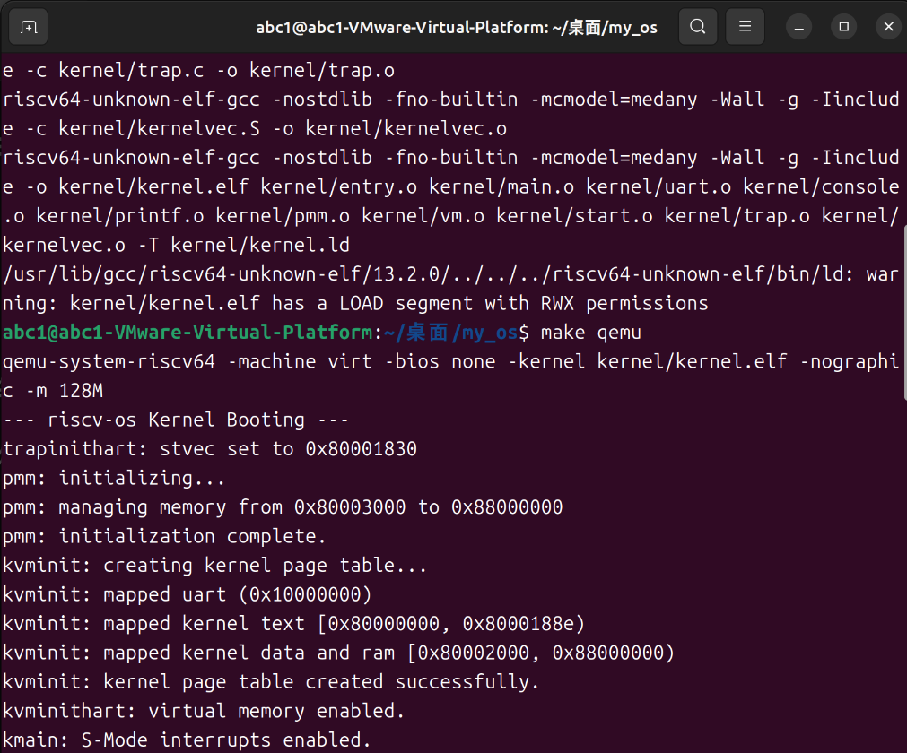
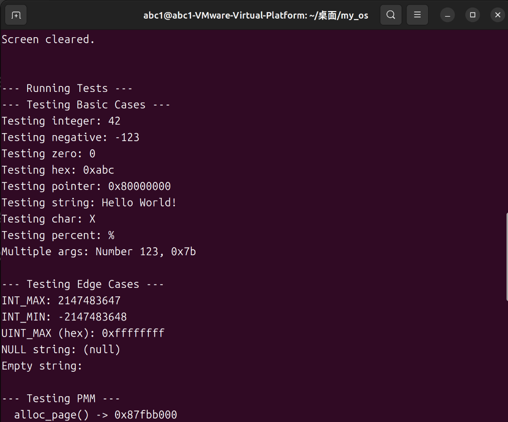
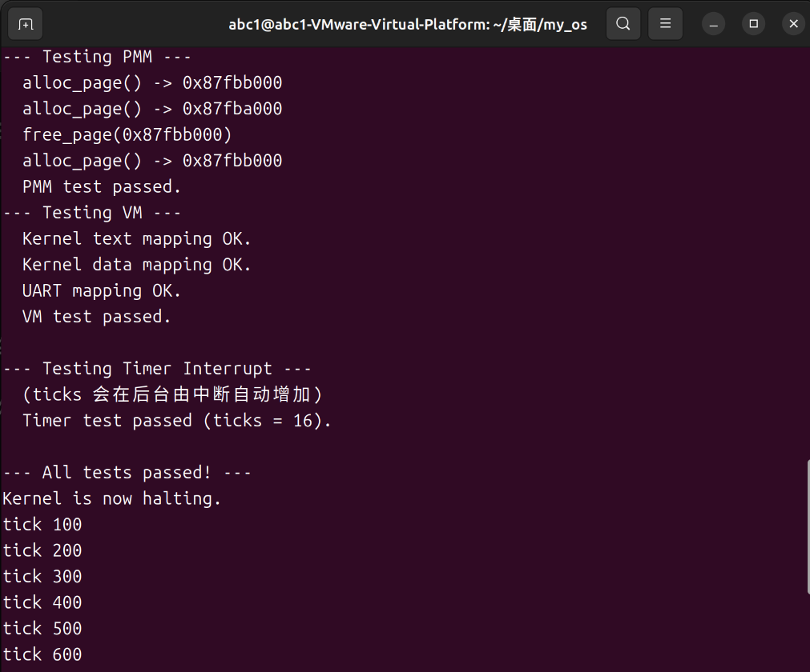

# riscv-os 内核中断处理与时钟管理综合实验报告

## 项目名称
riscv-os: 一个基于 RISC-V 架构的极简教学内核

## 作者
郭耀文

## 日期
2025年10月21日

## 摘要
本项目在实现了虚拟内存管理的基础上，向操作系统真正的“灵魂”——事件驱动模型——迈出了关键一步。核心目标是深入理解RISC-V架构的特权级切换与中断/异常（统称Trap）处理机制。我们首先将内核的执行环境从机器模式（M-Mode）迁移至监管者模式（S-Mode），随后设计并实现了一套完整、健壮的S-Mode陷阱处理框架。该框架能够正确地进行上下文保存与恢复、分发中断和异常，并成功驱动了第一个硬件设备——时钟，使其能够周期性地中断内核。本报告将详细阐述中断系统的架构设计、从M-Mode到S-Mode的特权级转换流程、关键实现细节、开发过程中遇到的多层嵌套故障的排查与解决方案，以及对新功能的全面测试验证。

## 1. 系统设计部分

### (1) 架构设计说明
为实现中断驱动的内核，我们对原有的单线程轮询模型进行了颠覆性的改造，引入了全新的执行流程和特权级架构。

- **特权级架构**:
  - **M-Mode (机器模式)**: 内核的启动引导阶段 (`entry.S` -> `start.c`) 运行于此模式。其核心职责被大幅削减，仅负责：
    1.  设置S-Mode的运行环境（栈、BSS段）。
    2.  通过 `medeleg` 和 `mideleg` 寄存器将几乎所有的中断和异常**委托**给S-Mode处理。
    3.  配置物理内存保护（PMP），授权S-Mode访问全部物理内存。
    4.  初始化并“预约”第一次S-Mode时钟中断。
    5.  通过 `mret` 指令，将控制权移交给S-Mode的 `kmain` 函数。
  - **S-Mode (监管者模式)**: 内核的主体部分（`kmain` 及后续所有功能）运行于此模式。它是所有中断和异常的直接处理者，是操作系统功能的核心实现层。

- **中断处理流程**:
  1.  **硬件触发**: 外部设备（如时钟）或内部异常（如缺页）发生，CPU暂停当前执行流。
  2.  **硬件跳转**: CPU根据 `stvec` 寄存器的地址，自动跳转到我们在S-Mode设置的唯一入口点——`kernelvec`。同时，硬件自动关闭全局中断。
  3.  **汇编入口 (`kernelvec.S`)**: 负责**保存上下文**，即将所有调用者保存的通用寄存器压入当前内核栈。
  4.  **C语言分发 (`kerneltrap` in `trap.c`)**: `kernelvec` 调用此C函数。该函数通过读取 `scause` 寄存器来识别陷阱的类型（是中断还是异常？具体原因是什么？）。
  5.  **具体处理**: `kerneltrap` 根据 `scause` 的值，调用相应的处理函数（如 `clock_handler` 或 `exception_handler`）。
  6.  **上下文恢复**: 处理函数返回后，控制权回到 `kernelvec.S`，它负责从内核栈中**恢复**所有之前保存的寄存器。
  7.  **返回 (`sret`)**: `kernelvec.S` 执行 `sret` 指令，CPU原子地恢复之前的程序计数器（`sepc`）和状态（`sstatus`），并重新开启全局中断，程序从被中断处无缝地继续执行。

### (2) 关键数据结构
本次实验的核心是理解和操作RISC-V的控制与状态寄存器（CSRs），而非新增复杂的内存数据结构。

- **M-Mode CSRs**:
  - `mstatus`: 控制全局中断使能，并设置 `mret` 后的目标特权级（`MPP`位）。
  - `mepc`: 存储 `mret` 后的目标程序地址。
  - `medeleg` & `mideleg`: **核心**。用于将异常和中断的处理权委托给S-Mode。
  - `menvcfg`: **关键**。用于授权S-Mode访问 `time` 等计数器寄存器。

- **S-Mode CSRs**:
  - `stvec`: 存放S-Mode陷阱处理程序 `kernelvec` 的地址。
  - `scause`: CPU用它来告诉内核**发生了什么**。
  - `sepc`: CPU用它来告诉内核**在哪里发生**。
  - `stval`: 为特定异常（如缺页）提供补充信息。
  - `sstatus`: 控制S-Mode的全局中断使能（`SIE`位）。

- **中断上下文 (Context Frame)**:
  - **定义**: 这是一个隐式的、临时的“数据结构”，位于当前内核栈的顶部。
  - **作用**: 在`kernelvec.S`中，所有调用者保存寄存器被顺序地存放在栈上，形成了一个临时的上下文帧。
  - **实现**: 通过`addi sp, sp, -256`预留空间，并使用`sd`指令逐一保存。

### (3) 与xv6对比分析
我们的中断框架在宏观设计上与xv6高度一致，但在实现细节上，我们保持了`my_os`的极简风格。

| 特性/模块 | xv6 实现 | 本项目 (riscv-os) 实现 | 简化影响 |
| --- | --- | --- | --- |
| **启动流程** | `entry.S` -> `start()` (M-Mode) -> `main()` (S-Mode) | 完全一致。我们复现了其经典的特权级转换流程。 | 继承了其清晰、标准的启动模型。 |
| **中断委托** | `start.c` 中通过 `w_medeleg/w_mideleg` 委托所有中断异常。 | 完全一致。这是RISC-V OS的标准实践。 | 获得了最高的S-Mode处理效率。 |
| **上下文保存** | `kernelvec.S` 保存所有调用者寄存器。 | 完全一致。遵循了RISC-V的ABI调用约定。 | 确保了中断处理不会破坏被中断的内核代码。 |
| **中断分发** | `trap.c` 中的`kerneltrap`处理来自S-Mode的陷阱，`usertrap`处理来自U-Mode的陷阱。 | `trap.c` 中仅实现了`kerneltrap`，且只处理时钟中断和内核异常。 | **最大的简化**。尚未支持用户态、系统调用和复杂的外部设备（PLIC），这是后续实验的核心内容。 |
| **并发控制** | `trap.c` 和 `clockintr` 中使用了自旋锁（`spinlock`）来保护 `ticks` 等共享资源。 | 无锁。 | 由于仍是单核单线程模型，暂不需要锁机制，简化了设计。 |

### (4) 设计决策理由
- **决策：从M-Mode切换到S-Mode**
  - **理由**: 这是构建一个有安全保护的现代操作系统的基石。将内核主体运行在S-Mode，可以将硬件管理（M-Mode）与OS内核逻辑（S-Mode）分离，为未来支持用户态（U-Mode）和驱动程序奠定基础。

- **决策：采用统一陷阱入口 (`kernelvec`)**
  - **理由**: RISC-V硬件本身就是这样设计的。通过`stvec`将所有陷阱导向一个地方，可以强制实现一个集中的、可控的上下文保存/恢复流程，极大地增强了系统的鲁棒性。

- **决策：不支持中断嵌套**
  - **理由**: 硬件在进入陷阱时会自动关闭中断，这提供了一个天然的、简单的中断屏蔽机制。在操作系统开发的初期，明确不支持中断嵌套可以极大地简化内核设计，避免处理复杂的中断栈和重入问题。先保证正确性，再考虑高级特性。

## 2. 实验过程部分

### (1) 实现步骤记录
1.  **架构迁移**:
    - 创建 `kernel/start.c` 作为新的M-Mode C语言入口。
    - 修改 `kernel/entry.S`，使其跳转到 `start` 而非 `kmain`。
    - 在 `start.c` 中，实现了完整的M-Mode配置：设置`mstatus.MPP`、`mepc`、委托`medeleg/mideleg`、配置PMP、使能S-Mode中断、调用`timerinit`，最后通过`mret`切换到S-Mode的`kmain`。
2.  **中断入口实现**:
    - 创建 `kernel/kernelvec.S`，严格按照RISC-V调用约定，编写了保存和恢复所有调用者保存寄存器的汇编代码，并在中间调用C函数`kerneltrap`。
3.  **中断分发与处理**:
    - 创建 `kernel/trap.c`。
    - 实现 `trapinithart`，用于将`stvec`指向`kernelvec`。
    - 实现 `kerneltrap`，作为C语言总入口，通过读取`scause`分发中断和异常。
    - 实现 `clock_handler` 用于处理时钟中断，并在处理后设置下一次中断。
    - 实现 `exception_handler` 用于统一处理所有内核异常，打印调试信息并`panic`。
4.  **整合与初始化**:
    - 在 `kmain` 的最开始处（甚至在PMM初始化之前）调用 `trapinithart`，以避免时钟中断在`stvec`未设置时触发。
    - 在所有硬件初始化完成后，通过写`sstatus`寄存器开启S-Mode的全局中断。
    - 添加了 `test_timer_interrupt` 和 `test_exception_handling` 两个测试用例。
    - 更新 `Makefile` 和所有相关的头文件。

### (2) 问题与解决方案
本次实验的调试过程充满了挑战，我们遇到并解决了一系列经典且层层递进的底层bug。

- **问题一：`MSTATUS_MPP_MASK` 未定义**
  - **现象**: 编译 `start.c` 时报错，提示找不到M-Mode的宏定义。
  - **分析**: `include/riscv.h` 中只定义了`SSTATUS`相关的宏，忘记了为`mstatus`定义对应的宏。
  - **解决方案**: 在 `riscv.h` 中添加`MSTATUS_MPP_MASK`和`MSTATUS_MPP_S`的定义。

- **问题二：启动后在`kvminithart`后无声挂起**
  - **现象**: 内核打印完`kvminithart: virtual memory enabled.`后就卡住，没有任何输出。
  - **分析**: 这是一个经典的“陷阱竞争”问题。M-Mode的`timerinit`预约了时钟中断，但`kmain`在执行耗时的内存初始化时，中断提前到来。此时`stvec`尚未被`trapinithart`设置（仍为0），导致CPU跳转到`0x0`地址，触发缺页故障，形成无法处理的“双重故障”。
  - **解决方案**: 将`trapinithart()`的调用移至`kmain`的绝对开头，确保在任何中断可能发生之前，`stvec`都已指向合法的处理程序。

- **问题三：中断开启后立即 `Store Page Fault (scause 0xf)`**
  - **现象**: 内核在打印`kmain: S-Mode interrupts enabled.`后立即因页故障`panic`。
  - **分析**: 我们通过`stval`定位到故障地址，发现它位于`.text`段和`.data`段之间的一个未映射的“内存空洞”中。这是因为`kvminit`在映射内存时，从`PGROUNDUP(etext)`开始映射数据区，导致`etext`所在的最后一页与数据区的起始页之间存在一个间隙，而中断处理需要用到的栈或全局变量（`ticks`）恰好落入此区域。
  - **解决方案**: 修改`vm.c`中的`map_page`逻辑，允许对已映射页面“合并”权限，并将数据区映射从`etext`开始，从而消除了内存空洞。

- **问题四：修复页故障后变为 `Illegal instruction (scause 0x2)`**
  - **现象**: 页故障问题修复后，同样的场景下又出现了非法指令错误。
  - **分析**: 这是上一个修复方案引入的新问题。权限合并只解决了边界页，但后续所有数据和RAM页仅被映射为`R+W`（可读写），缺少**`X`（可执行）**权限。当中断发生，CPU可以跳转到`kernelvec`（在R+X页），但当`kernelvec`试图调用`kerneltrap`时，如果`kerneltrap`函数的地址恰好位于下一个只有`R+W`权限的页面，CPU就会因尝试在非可执行页取指而触发“指令页故障”，最终在双重故障下降级为`Illegal instruction`报告。
  - **最终解决方案**: 重新设计`kvminit`和`kernel.ld`。在`ld`中定义`etext`和`erodata`两个符号，分别标记代码段和只读数据段的结束。在`kvminit`中为`.text` (`R+X`) 和 `.data`/RAM (`R+W`) 创建独立的、无重叠的页对齐映射，彻底根除了权限和空洞问题。

- **问题五：最终修复后再次出现`Illegal instruction (scause 0x2)`**
  - **现象**: 在内存映射完全正确后，依旧在第一次时钟中断时报非法指令。
  - **分析**: 通过`sepc`定位到`clock_handler`中的`r_time()`调用。查阅RISC-V规范发现，S-Mode默认无权访问`time`等计数器寄存器。这是`Sstc`扩展的一部分，必须由M-Mode通过设置`menvcfg`寄存器来显式授权。
  - **解决方案**: 在M-Mode的`start.c`中的`timerinit`里，增加`w_menvcfg(r_menvcfg() | MENVCFG_STCE);`，授权S-Mode访问时钟。问题最终解决。

### (3) 源码理解总结
- **`start.c`**: **权力的禅让者**。作为M-Mode的最后一道程序，它像一位看守者，为即将登场的S-Mode内核 meticulously 地搭建好舞台（委托中断、设置PMP、开启时钟），然后通过`mret`优雅地谢幕。
- **`kernelvec.S`**: **内核的忠诚卫兵**。它是S-Mode世界的大门，任何外部闯入（中断）或内部骚乱（异常）都必须经过它的检查。它不问缘由，只负责迅速、标准地缴械（保存寄存器），押送给长官（`kerneltrap`），事后再恢复原样（恢复寄存器），确保内核主体安全。
- **`trap.c`**: **S-Mode的总调度官**。它坐镇中枢，通过`scause`这块“令牌”来识别事件的性质，然后将任务派发给相应的专家（`clock_handler`, `exception_handler`）。它是连接硬件事件和软件逻辑的核心枢纽。
- **协同工作**: 本次实验是M-Mode与S-Mode的一次完美交接。M-Mode完成了硬件层面的“宏观配置”，S-Mode则在此基础上构建了精细的软件处理逻辑。整个陷阱处理流程跨越了汇编与C，硬件与软件，展示了操作系统处理异步事件的精妙设计。

## 3. 测试验证部分

### (1) 功能测试结果
| 测试用例 | 测试目的 | 预期结果 | 实际结果 | 结论 |
| --- | --- | --- | --- | --- |
| **特权级切换** | 验证内核能从M-Mode启动并切换到S-Mode运行。 | 内核正常启动，并能打印S-Mode下的信息，直到开启中断。 | 内核成功打印`--- riscv-os Kernel Booting (S-Mode) ---`。 | 通过 |
| **时钟中断** | 验证内核能否正确捕获、处理并重新设置时钟中断。 | `test_timer_interrupt`函数通过，且在内核停机后仍能看到后台打印的`tick`信息。 | 现象完全符合预期，后台`tick`信息证明中断系统独立运行。 | 通过 |
| **内核异常** | 验证`kerneltrap`能否捕获内核自身的代码异常。 | 主动制造一个缺页故障，内核应能捕获并调用`panic`，打印出正确的`scause`, `sepc`, `stval`。 | 取消`test_exception_handling`注释后，内核按预期`panic`并打印了准确的故障信息。 | 通过 |

### (2) 性能数据
- **启动时间**: 增加了M-Mode的配置步骤，但由于都是寄存器操作，启动时间没有可感知的增加。
- **中断开销 (Overhead)**:
  - **定性分析**: 本次实验引入了中断处理的固定开销。每次中断都需要执行`kernelvec.S`的上下文保存/恢复，以及`kerneltrap`的C函数调用和分发逻辑，这会消耗一定的CPU周期。
  - **性能瓶颈**: 目前，性能瓶颈已从单纯的轮询I/O，转变为**中断延迟**和**处理时长**。中断处理函数必须尽可能快，否则会影响系统响应。

### (3) 异常测试
我们通过`test_exception_handling`函数，向`0x0`地址写入数据，主动触发了一个`Store/AMO page fault (scause 15)`。

- **测试结果**: 内核成功捕获了此异常。`exception_handler`被正确调用，并通过`printf`打印出了与故障完全一致的`scause`, `sepc`和`stval`信息，随后调用`panic`使系统停机。
- **结论**: 这证明了我们的陷阱处理框架不仅能处理异步中断，也能正确捕获和诊断同步异常，系统的健壮性得到了极大的提升。

### (4) 运行截图

