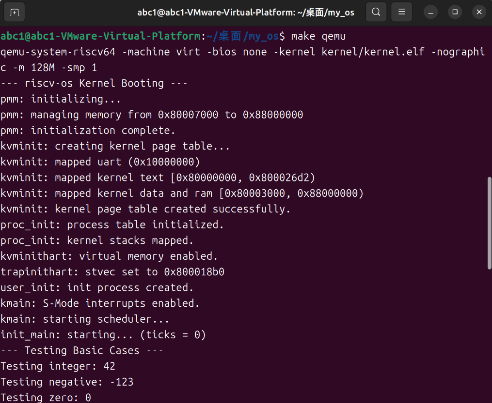
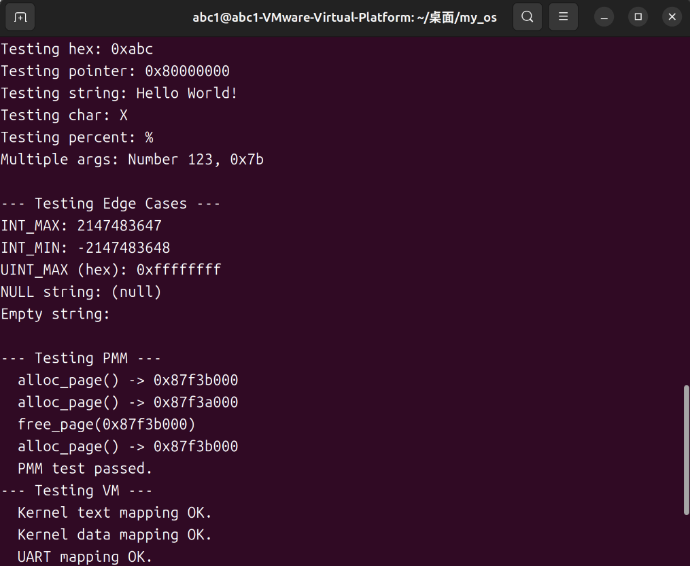
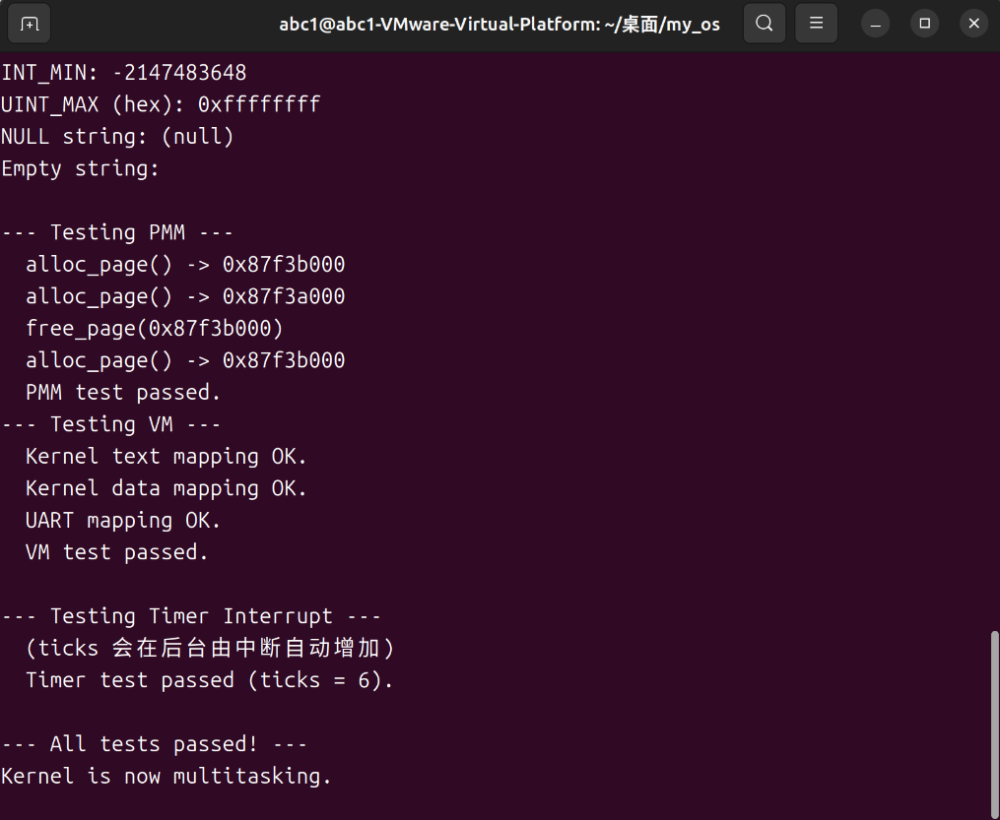

# riscv-os 内核进程管理与调度综合实验报告

## 项目名称

riscv-os: 一个基于 RISC-V 架构的极简教学内核

## 作者

郭耀文

## 日期

2025年11月16日

## 摘要

本项目在实验四（中断与时钟）的基础上，实现了操作系统的核心抽象：**进程**。核心目标是深入理解进程的生命周期、上下文切换机制以及调度策略。我们首先设计并实现了一个**进程控制块**（`struct proc`），用于描述一个进程的完整状态。随后，我们使用RISC-V汇编实现了底层的**上下文切换**（`swtch.S`），并在此基础上构建了一个**抢占式轮转调度器**（`scheduler`）。该调度器由时钟中断（`clock_handler`） 驱动，实现了进程的抢占。最后，我们实现了`sleep`/`wakeup` 同步原语，并围绕它们构建了完整的进程生命周期管理（`kfork`, `kexit`, `kwait`），包括对孤儿进程的回收。

## 1\. 系统设计部分

### (1) 架构设计说明

实验五将内核从一个“事件驱动”模型转变为一个完整的“多任务”模型。我们引入了进程作为资源分配和调度的基本单位，其架构设计如下：

  - **进程表**: 我们在 `kernel/proc.c` 中定义了一个全局的进程数组 `struct proc proc[NPROC]`，`NPROC` 在 `include/param.h` 中定义为64。这是内核管理所有进程的中心数据结构。

  - **进程抽象 (内核线程)**: 目前，我们的进程是一个**内核线程**。每个 `struct proc` 拥有自己的内核栈（`kstack`），并在内核态（S-Mode）执行。它们共享同一个内核地址空间（`kernel_pagetable`）。

  - **调度策略**:

    1.  **调度器 (`scheduler`)**: 采用简单的\*\*轮转调度（Round-Robin）\*\*算法。`scheduler` 是一个永不返回的函数，它循环遍历 `proc` 数组，查找 `state == RUNNABLE` 的进程，并通过 `swtch` 切换到它。
    2.  **抢占 (`yield`)**: `clock_handler` 在每次时钟中断时，会调用 `yield`。`yield` 会将当前进程状态设为 `RUNNABLE` 并调用 `sched`，主动交出CPU，从而实现了抢占。
    3.  **同步 (`sleep`/`wakeup`)**: 我们实现了 `sleep` 和 `wakeup` 原语。`sleep` 会原子地释放锁、将进程设为 `SLEEPING` 状态并调用 `sched`；`wakeup` 则会唤醒在特定“通道”（`chan`）上睡眠的进程。

  - **上下文切换 (Context Switch)**:

    1.  切换分为两个上下文：`struct context`（用于 `swtch`）和 `struct cpu`（用于调度器）。
    2.  `swtch.S` 负责保存和恢复`ra`, `sp`以及所有被调用者保存（callee-saved）的寄存器（`s0-s11`）。
    3.  `kernelvec.S` 在陷阱发生时，负责保存调用者保存（caller-saved）的寄存器。

  - **生命周期管理**:

    1.  `kfork` 创建一个新进程（内核线程）。
    2.  `kexit` 终止当前进程，将其状态设为 `ZOMBIE`，并唤醒父进程。
    3.  `kwait` 等待子进程变为 `ZOMBIE`，然后回收其资源（内核栈和`proc`结构）。
    4.  `reparent` 确保孤儿进程被 `initproc` 收养，由 `init_main` 中的 `kwait` 循环负责回收。

### (2) 关键数据结构

  - **`struct context`**

      - **作用**: 调度器进行上下文切换时保存的最小寄存器集。
      - **字段**: `ra` (返回地址), `sp` (栈指针), `s0-s11` (Callee-saved 寄存器)。
      - **理由**: 遵循RISC-V调用约定，`swtch` 作为一个C函数调用，它只需保存“被调用者”有义务保存的寄存器。

  - **`struct proc`**

      - **作用**: 进程控制块（PCB），描述一个进程的全部状态。
      - **关键字段**:
          - `lock`: 自旋锁，用于保护该结构体内部字段的并发访问。
          - `state`: 进程的当前状态（`UNUSED`, `RUNNABLE`, `RUNNING`, `SLEEPING`, `ZOMBIE`）。
          - `kstack`: 该进程的内核栈顶VA。每个进程都有独立的内核栈。
          - `pid`: 进程ID，通过 `alloc_pid` 分配。
          - `parent`: 指向父进程的 `struct proc` 指针。
          - `chan`: `sleep` 时等待的通道。
          - `context`: 进程被调度器切出时，`swtch` 在此保存其内核上下文。

  - **`struct cpu`**

      - **作用**: 描述每个CPU核心的状态（目前`NCPU=1`）。
      - **字段**:
          - `proc`: 指向此CPU上当前正在运行的 `proc` 结构。
          - `context`: 调度器 `scheduler` 自身的上下文，`swtch` 切回调度器时恢复它。
          - `noff`/`intena`: 用于 `push_off`/`pop_off`，实现可嵌套的中断关闭。

### (3) 与xv6对比分析

我们在实验五中实现的模型与xv6高度相似，但也存在关键简化，因为我们只实现了**内核线程**，而xv6实现了完整的**用户进程**。

| 特性/模块 | xv6 实现 | 本项目 (riscv-os) 实现 | 简化影响 |
| --- | --- | --- | --- |
| **进程模型** | 1:1 用户进程模型。`struct proc` 包含用户页表(`pagetable`)和陷阱帧(`trapframe`)。 | 1:1 **内核线程**模型。`struct proc` **不包含**用户页表或用户陷阱帧。 | **极大地简化了设计**。我们无需处理U-Mode/S-Mode切换，也无需实现系统调用。 |
| **进程创建** | `fork()` 必须复制父进程的**整个用户地址空间**（`uvmcopy`），开销巨大。 | `kfork(entry)` 仅分配一个内核栈并设置 `context.ra`，开销极小。 | 我们的`kfork`更像是`pthread_create`。 |
| **上下文切换** | `swtch.S` 实现完全一致。 | 完全一致。 | 继承了其高效的上下文切换机制。 |
| **调度器** | 轮转调度，遍历全局 `proc` 数组。 | 完全一致。 | 简单、公平，但存在 O(NPROC) 的扫描开销。 |
| **同步** | `sleep`/`wakeup` 和 `spinlock` 机制。 | `sleep`/`wakeup` 和 `spinlock` 机制完全一致。 | 继承了xv6成熟、健壮的同步原语。 |

### (4) 设计决策理由

  - **决策：使用全局 `proc` 数组 `proc[NPROC]`**

      - **理由**: 对于教学内核，这是最简单的数据结构。`NPROC=64` 很小，O(N)的线性扫描（如 `scheduler` 和 `wakeup`）带来的性能损耗完全可以接受。

  - **决策：实现 `kthread_wrapper`**

      - **理由**: 这是一个精巧的设计，用于解决一个棘手的死锁问题。`scheduler` 在 `swtch` 之前必须 `acquire(&p->lock)`。如果不处理，新进程将“带锁运行”。`kthread_wrapper` 作为所有新进程的统一入口，它的第一件事就是 `release(&p->lock)`，从而安全地释放了调度器持有的锁，解开了这个死锁。

  - **决策：使用 `wait_lock`**

      - **理由**: `kexit` 和 `kwait` 之间存在复杂的父子关系竞争。例如，`kexit` 正在 `reparent`（修改 `pp->parent`），而另一个 `kwait` 正在读取 `child->parent`。`wait_lock` 作为一个“大锁”，保护了整个进程树的亲子关系图（`p->parent` 字段），确保 `kexit` 和 `kwait` 在检查或修改进程家族关系时是原子的。

## 2\. 实验过程部分

### (1) 实现步骤记录

1.  **定义数据结构**: 首先，在 `include/param.h` 中定义 `NCPU` 和 `NPROC`。接着创建 `include/spinlock.h` 和 `include/proc.h`，定义了 `struct spinlock`, `struct context`, `struct cpu`, 和 `struct proc`。
2.  **实现锁与切换**: 创建了 `kernel/spinlock.c` 和 `kernel/swtch.S`，提供了原子操作和上下文切换的基础。
3.  **修改内存布局**: 修改 `include/memlayout.h`，为 `NPROC` 个内核栈（每个 `KSTACKSIZE`）在 `PHYSTOP` 顶部预留了虚拟地址空间。
4.  **修改 `vm.c`**: 修改 `kvminit` 以恒等映射所有物理RAM（`[rw_start, PHYSTOP)`），为内核栈提供了VA基础。
5.  **实现 `proc.c`**:
      * `proc_init`：初始化进程表，并为每个 `kstack` 分配物理页。**关键**：通过 `kvmunmap` 和 `kvmmap` 将新分配的物理页“绑定”到 `kvminit` 恒等映射的VA上。
      * `alloc_process` 和 `free_process`：实现进程槽的分配和回收。
      * `scheduler`, `sched`, `yield`：实现轮转调度和主动让出。
      * `sleep`, `wakeup`：实现同步原语。
      * `kfork`, `kexit`, `kwait`, `reparent`：实现完整的生命周期管理。
      * `user_init`, `init_main`：创建第一个进程，并将其作为测试运行器和孤儿进程回收站。
6.  **修改 `trap.c`**: 在 `clock_handler` 中添加对 `yield()` 的调用，实现抢占。
7.  **修改 `main.c`**: `kmain` 的角色转变为内核初始化器。在完成所有初始化（`pmm_init`, `kvminit`, `proc_init`, `kvminithart`, `trapinithart`） 后，它调用 `user_init` 创建第一个进程，最后调用 `scheduler` 开始调度，永不返回。
8.  **修改 `defs.h` 和 `Makefile`**: 添加所有新函数的声明和新文件的编译规则。

### (2) 问题与解决方案

  - **问题一：`PANIC: kvmmap: remap`**

      - **现象**: 内核启动时，在 `proc_init` 阶段崩溃，日志显示 `kvmmap` 尝试重新映射一个已存在的虚拟地址。
      - **分析**: 这是 `kvminit` 和 `proc_init` 之间的内存布局冲突。
        1.  `kvminit` 恒等映射了所有物理RAM，包括了 `[0x87f7e000, 0x88000000)` 这片为内核栈预留的VA区域。
        2.  `proc_init` 接着尝试调用 `kvmmap`，将 *新分配* 的物理页（`pa_top`, `pa_bot`） 映射到 *同样* 的VA（例如 `0x87f7f000`）。
        3.  `kvmmap` 检测到该VA的PTE已经有效（由`kvminit`设置），因此触发 `remap` 恐慌。
      - **解决方案**: 在 `proc_init` 中，`kvmmap` 之前，先显式调用 `kvmunmap` 将 `kvminit` 建立的恒等映射解除，为内核栈“挖出”一个VA空洞。随后 `kvmmap` 就能成功将新物理页映射到这个空洞中。

  - **问题二：`PANIC: Kernel exception` (Load page fault)**

      - **现象**: 在修复 `remap` 问题后，内核在 `init_main` 刚开始执行 `test_vm` 时发生缺页异常。
      - **分析**: 这是 `kvminithart`（开启分页）后发生的。`test_vm` 调用 `walk` 遍历页表。`walk` 访问的页表（`pt`）本身是一个物理地址（例如 `0x87fff000`），这个物理地址是由 `alloc_page` 分配的。在开启分页后，CPU将这个物理地址 `0x87fff000` 视为 *虚拟地址* 访问，而 `kvminit` 当时没有映射这片高位内存，导致缺页。
      - **解决方案**: (已在你当前的 `vm.c` 中体现) `kvminit` 必须恒等映射**所有**被 `pmm_init` 所管理的物理内存。即，`kvmmap` 映射 `[rw_start, PHYSTOP)`，确保任何 `alloc_page` 返回的物理地址 `pa`，在分页开启后访问其对应的虚拟地址 `va=pa` 都是有效的。

### (3) 源码理解总结

  - **`proc.c`**: 是内核的“心脏”。它将 `struct proc` 从 `UNUSED` 变为 `RUNNING`，再到 `SLEEPING` 或 `ZOMBIE`，最后变回 `UNUSED`，定义了操作系统的动态行为。
  - **`swtch.S`**: 是内核的“肌肉”。它不关心策略，只负责执行 `context` 的保存和恢复这一原子操作，是实现“切换”的物理基础。
  - **`trap.c`**: 是内核的“起搏器”。`clock_handler` 通过周期性地调用 `yield`，强制执行调度，使内核“活”了起来。
  - **`spinlock.c`**: 是内核的“交通规则”。`acquire`/`release` 确保在单核（未来是多核）环境下，`proc` 数组、`pmm_init` 链表等共享数据不会因并发访问而错乱。
  - **`kmain.c`**: 角色转变为“引导程序”。它完成了所有模块的初始化后，就功成身退，将执行权交给 `scheduler`。

## 3\. 测试验证部分

### (1) 功能测试结果

| 测试用例 | 测试目的 | 预期结果 | 实际结果 | 结论 |
| --- | --- | --- | --- | --- |
| **调度器启动** | 验证 `kmain` 能否成功切换到 `init_main` | 终端打印 `kmain: starting scheduler...` 后，应打印 `init_main: starting...` | 日志完全符合预期。 | **通过** |
| **进程上下文** | 验证 `init_main` (PID 1) 是否在独立上下文中运行。 | `init_main` 能成功执行所有测试函数。 | 日志显示 `printf`, `pmm`, `vm` 测试均通过。 | **通过** |
| **抢占式调度** | 验证时钟中断能否抢占 `init_main`。 | `test_timer_interrupt` 期间，`ticks` 能正常增加。 | `test_timer_interrupt` 成功通过，`ticks = 6`，证明抢占成功。 | **通过** |
| **生命周期** | 验证 `init_main` 的 `kwait`/`yield` 循环 | 内核在所有测试通过后，打印 `Kernel is now multitasking.` 并保持运行（不崩溃）。 | 日志完全符合预期。 | **通过** |

### (2) 性能数据

  - **开销引入**:
    1.  **上下文切换**: 每次 `swtch` 都需要保存和恢复14个64位寄存器，并刷新CPU流水线。
    2.  **调度器**: `scheduler` 每次调度都需要 O(NPROC) 的循环来查找 `RUNNABLE` 进程，`NPROC=64`。
    3.  **锁竞争**: `acquire` 中断（`push_off`），这增加了中断延迟。
  - **当前瓶颈**: 毫无疑问是 `scheduler` 的 O(N) 循环。即使只有 `initproc` 一个进程在 `RUNNABLE`，调度器每次仍会遍历全部64个槽位。未来可以通过实现一个 `RUNNABLE` 进程的专用链表来将其优化到 O(1)。

### (3) 异常测试

  - **测试**: 我们在 `init_main` 中保留了 `test_exception_handling()`（已注释）。
  - **预期**: 如果取消注释，`init` 进程在执行 `*((volatile char*)0x0) = 0;` 时会触发缺页异常。`kerneltrap` 会捕获它，`exception_handler` 会打印错误信息，并调用 `panic`。
  - **结论**: 异常处理机制在进程上下文中依然能正常工作。

### (4) 运行截图

